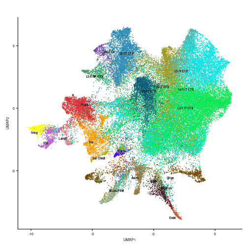
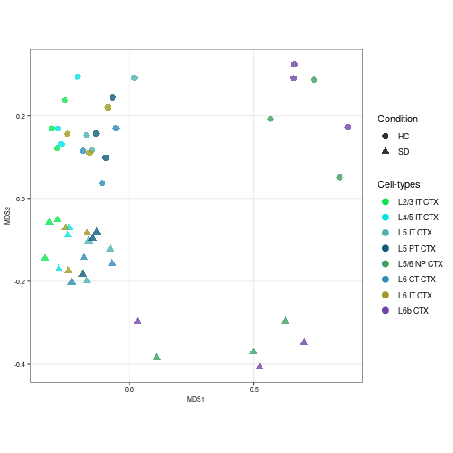
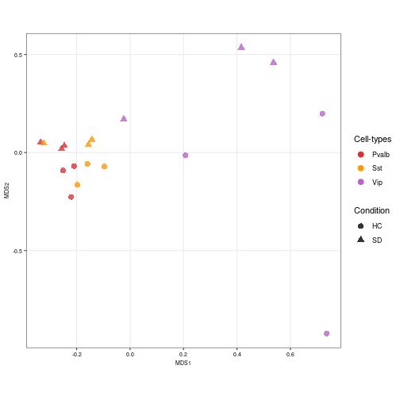
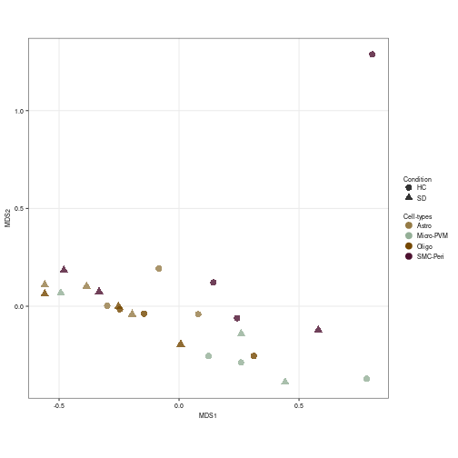
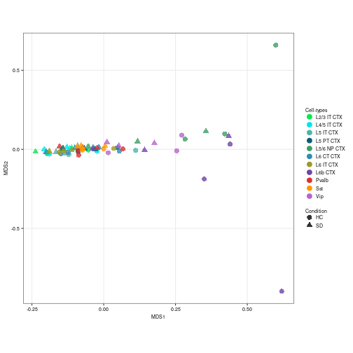

# Preliminaries

## Data Availability

Raw sequencing data for this analysis is stored in GEO under accession number [GSE211088](https://www.ncbi.nlm.nih.gov/geo/query/acc.cgi?acc=GSE211088). 

The code used in this analysis has been deposited into Github, and can be available [here](https://github.com/PeixotoLab/RNAseq_sleep/tree/main/02_analysis_snrnaseq).

## Bioconductor packages


To identify mitochondrial genes, we retrieve the chromosome location of each Ensembl gene with the *[EnsDb.Mmusculus.v79](https://bioconductor.org/packages/3.16/EnsDb.Mmusculus.v79)*.  package. We used the Bioconductor *[scuttle](https://bioconductor.org/packages/3.16/scuttle)*package to detect low quality and damaged droplets. The potential doublets removal was implemented in *[scuttle](https://bioconductor.org/packages/3.16/scuttle)* package. For cell-type assignment reference dataset was made available at [*AllenInstituteBrainData*](https://github.com/drighelli/AllenInstituteBrainData). Cell annotation was computed using two methods: [*Azimuth*](https://github.com/satijalab/azimuth) and *[SingleR](https://bioconductor.org/packages/3.16/SingleR)*. We used the *[scuttle](https://bioconductor.org/packages/3.16/scuttle)* package to create pseudo-bulk. The visualization of the MDS plot was implemented in *[muscat](https://bioconductor.org/packages/3.16/muscat)* package.


```r
library(Seurat)
library(SingleCellExperiment)
library(EnsDb.Mmusculus.v79)
library(scuttle)
library(scran)
library(scDblFinder)
library(ggplot2)
library(biomaRt)
library(muscat)
library(edgeR)
library(dplyr)
library(Azimuth)
library(SeuratData)
library(AllenInstituteBrainData)
```

# Data pre-processing

## Data setting

Load single-nuclear RNA-seq dataset.


```r
url <- "https://zenodo.org/records/10091236/files/sce_mouse_sleep_snrnaseq_complete.rds"
system(paste0("curl ", url, " -o sce_mouse_sleep_snrnaseq_complete.rds"))
snrna_data <- readRDS("sce_mouse_sleep_snrnaseq_complete.rds")
snrna_data
```

We added the UMI counts of spliced mRNA and introns sharing the same Ensembl ID. To identify mitochondrial genes, we retrieve the chromosome location of each ensembl gene with the EnsDb.Mmusculus.v79 package. We split the data into six SingleCellExperiment objects, one for each mouse.


```r
# Exons
exons <- snrna_data[-which(grepl("-I", rownames(snrna_data))), ]
rownames(exons) <- substring(rownames(exons), 1, 18)

introns <- snrna_data[which(grepl("-I", rownames(snrna_data))), ]
rownames(introns) <- substring(rownames(introns), 1, 18)

# We identified introns and exons with the same Ensembl ID
same_ensembl <- intersect(rownames(exons), rownames(introns))
exons <- exons[same_ensembl, ]
exons <- exons[order(rownames(exons)), ]
introns <- introns[same_ensembl, ]
introns <- introns[order(rownames(introns)), ]

rownames(snrna_data) <- substring(rownames(snrna_data), 1, 18)
# Remove the introns and exons with the same Ensembl ID from the
# single-nuclear data.
snrna_data <- snrna_data[!rownames(snrna_data) %in% same_ensembl,
    ]

# A new SingleCellExperiment object was created, where the sum
# of the UMI counts of spliced mRNA and introns sharing the same
# Ensembl ID was added.
sce <- SingleCellExperiment(assays = list(counts = rbind(counts(snrna_data),
    counts(exons) + counts(introns))))

colData(sce) <- colData(snrna_data)
sce$sample_id[sce$sample_id == "8E"] <- "6E"

# We created the sleep condition variable
sce$condition <- sce$sample_id
sce$condition[grep("C", sce$condition)] <- "HC"  # Home Cage (HC)
sce$condition[grep("E", sce$condition)] <- "SD"  # Sleep Deprivated (SD)

sce$sample_id <- paste(substr(sce$sample_id, 1, 1), sce$condition,
    sep = "")
```


```r
# To identify mitochondrial genes, we retrieved the chromosome
# location of each Ensembl Gene ID.
ensids <- rownames(sce)
map <- mapIds(EnsDb.Mmusculus.v79, keys = ensids, column = "SEQNAME",
    keytype = "GENEID")

stopifnot(length(map) == nrow(sce))
rowData(sce)$CHR <- map

# We split the data into six SingleCellExperiment objects, one
# for each mouse.
scelist <- list(sce[, sce$sample_id == "1HC"], sce[, sce$sample_id ==
    "2SD"], sce[, sce$sample_id == "3HC"], sce[, sce$sample_id ==
    "4SD"], sce[, sce$sample_id == "5HC"], sce[, sce$sample_id ==
    "6SD"])
```

## Quality controls

For each sample, we used the Bioconductor scuttle package to detect low quality and damaged droplets. Particularly, we computed per-cell quality-control metrics with the *perCellQCMetrics* function; these metrics include the sum of UMI counts, the number of detected genes, and the percentage of mitochondrial counts.


```r
scelist_filt <- list()
for (i in seq_along(scelist)) {
    stats <- perCellQCMetrics(scelist[[i]], subsets = list(Mito = which(rowData(scelist[[i]])$CHR ==
        "MT")))
    high_mito <- isOutlier(stats$subsets_Mito_percent, type = "higher")

    colData(scelist[[i]]) <- cbind(colData(scelist[[i]]), stats)
    scelist[[i]]$high_mito <- high_mito

    qc_lib <- isOutlier(scelist[[i]]$sum, log = TRUE, type = "lower")
    qc_nexprs <- isOutlier(scelist[[i]]$detected, log = TRUE, type = "lower")
    discard <- qc_lib | qc_nexprs | scelist[[i]]$high_mito

    scelist_filt[[i]] <- scelist[[i]][, !discard]
}

# Log-normalized counts
scelist_filt <- lapply(scelist_filt, function(x) logNormCounts(x))
```

## Doublets removal

Lastly, for each sample, we removed potential doublets with the scDblFinder (v1.12.0) package, using the *computeDoubletDensity* function to calculate the scores and the *doubletThresholding* function to set the doublet scores threshold with the *griffiths* method.


```r
# HVGs were calculated for each sample
topgs <- lapply(scelist_filt, function(x) getTopHVGs(x, prop = 0.1))

for (i in seq_along(scelist_filt)) {
    set.seed(422)
    # Function to calculate the scores
    scores <- computeDoubletDensity(scelist_filt[[i]], subset.row = topgs[[i]])
    # Function to set the doublet scores threshold
    dbl_calls <- doubletThresholding(data.frame(score = scores), method = "griffiths",
        returnType = "call")

    colData(scelist_filt[[i]]) <- cbind.DataFrame(colData(scelist_filt[[i]]),
        dbl_calls, scores)
}

scelist_sgl <- lapply(scelist_filt, function(u) u[, !u$dbl_calls ==
    "doublet"])
names(scelist_sgl) <- levels(factor(sce$sample_id))

scelist_sgl
```

# Cell-type annotation

## Reference dataset

To identify cell types, we used the [Allen Whole Cortex & Hippocampus - 10x genomics (v2021)](https://www.sciencedirect.com/science/article/pii/S0092867421005018) as reference dataset . This dataset was imported by the *AllenInstituteBrainData* function of the AllenInstituteBrainData. We then selected the “Non-Neuronal”, “Glutamatergic” and “GABAergic” clusters coming from the Visual Cortex (VIS, VISl, VISm, VISp) to annotate our dataset. For computational issues, we selected a random subset of 100,000 cortical cells.
Cell annotation was computed with an automatic and reference-based method: Azimuth.


```r
# Load reference dataset
reference <- AllenInstituteBrainData("Allen_Mouse_2021")
rownames(reference) <- rowData(reference)$X
reference

# Select clusters from the Visual Cortex
reference <- reference[, c(reference$region_label == "VIS" | reference$region_label ==
    "VISl" | reference$region_label == "VISm" | reference$region_label ==
    "VISp")]
# Select cortex labels
reference <- reference[, !is.na(reference$subclass_label) & reference$subclass_label !=
    ""]
reference <- reference[, -which(grepl("ENT", reference$subclass_label))]
reference <- reference[, -which(grepl("PPP", reference$subclass_label))]
reference <- reference[, -which(grepl("CR", reference$subclass_label))]
reference <- reference[, -which(grepl("Meis", reference$subclass_label))]
reference <- reference[, -which(grepl("SUB", reference$subclass_label))]

# For computational issues, we decided to select 100,000
# cortical random cells.  First, all cell was selected from the
# cell types with less than 100 cells.
no_random <- reference[, c(reference$subclass_label == "SMC-Peri" |
    reference$subclass_label == "VLMC")]

# The resting cell types were selected.
reference <- reference[, !c(reference$subclass_label == "SMC-Peri" |
    reference$subclass_label == "VLMC")]

df <- data.frame(colData(reference))
# First, we randomly selected 100 cells for each cell type.
set.seed(23)
random <- df %>%
    group_by(subclass_label) %>%
    slice_sample(n = 100)
random100 <- reference[, colnames(reference) %in% random$sample_name]

reference <- reference[, !(colnames(reference) %in% random$sample_name)]

# Then, we randomly selected 98046 of the resting cells
set.seed(23)
reference <- reference[, sample(colnames(reference), 98046)]

reference <- cbind(reference, random100, no_random)
reference
```

## Cell-type annotation with Azimuth

For the Azimuth method, the reference data was converted into a Seurat object and into a Azimuth compatible object, using the *AzimuthReference* function of the Azimuth package. Then query samples were merged and were converted into a Seurat object.


```r
# First, the reference dataset was converted into Seurat object
counts <- as.matrix(counts(reference))
coldata <- colData(reference)
reference_so <- CreateSeuratObject(counts = counts, meta.data = data.frame(coldata))

# And we created a compatible object for Azimuth cell annotation
reference_so <- SCTransform(reference_so, assay = "RNA", new.assay.name = "SCT",
    variable.features.n = 2000, verbose = TRUE, conserve.memory = TRUE)
reference_so <- RunPCA(reference_so, assay = "SCT", npcs = 50, verbose = FALSE,
    reduction.name = "PCA", return.model = TRUE)
reference_so <- RunUMAP(reference_so, assay = "SCT", reduction = "PCA",
    dims = seq_len(50), seed.use = 1, verbose = FALSE, reduction.name = "umap",
    return.model = TRUE)

reference_so$subclass_label <- as.factor(reference_so$subclass_label)
Idents(object = reference_so) <- "subclass_label"

# Azimuth-compatible object
reference_azimuth <- AzimuthReference(reference_so, refUMAP = "umap",
    refDR = "PCA", refAssay = "SCT", dims = 1:50, metadata = c("subclass_label"),
    verbose = TRUE)

# save reference in a folder called 'reference'
ref_dir <- "reference/"
SaveAnnoyIndex(object = reference_azimuth[["refdr.annoy.neighbors"]],
    file = file.path(ref_dir, "idx.annoy"))
saveRDS(object = reference_azimuth, file = file.path(ref_dir, "ref.Rds"))
```

The query dataset was converted into a Seurat object.


```r
# The six SingleCellExperiment were combined and converted into
# a Seurat object.
counts <- cbind(counts(scelist_sgl[[1]]), counts(scelist_sgl[[2]]),
    counts(scelist_sgl[[3]]), counts(scelist_sgl[[4]]), counts(scelist_sgl[[5]]),
    counts(scelist_sgl[[6]]))

sample_id <- c(scelist_sgl[[1]]$sample_id, scelist_sgl[[2]]$sample_id,
    scelist_sgl[[3]]$sample_id, scelist_sgl[[4]]$sample_id, scelist_sgl[[5]]$sample_id,
    scelist_sgl[[6]]$sample_id)

condition <- c(scelist_sgl[[1]]$condition, scelist_sgl[[2]]$condition,
    scelist_sgl[[3]]$condition, scelist_sgl[[4]]$condition, scelist_sgl[[5]]$condition,
    scelist_sgl[[6]]$condition)

sce_obj <- SingleCellExperiment(assays = list(counts = counts))
sce_obj$sample_id <- sample_id
sce_obj$condition <- condition
colnames(sce_obj) <- paste(colnames(sce_obj), sce_obj$sample_id, sep = "_")

# SCE object was converted into a Seurat object
seurat_obj <- CreateSeuratObject(counts = counts(sce_obj), meta.data = data.frame(colData(sce_obj)))
```

Cell annotation was computed using the *RunAzimuth* function of the Azimuth package. The t-SNE and the UMAP embeddings were computed using the *RunTSNE* and *RunUMAP* functions of the Seurat package with seed.use = 1.


```r
# Cell-type annotation with Azimuth
seurat_obj <- RunAzimuth(seurat_obj, reference = "reference/")

# Dimensional reduction
seurat_obj <- RunTSNE(seurat_obj, reduction = "integrated_dr", dims = seq_len(20),
    seed.use = 1, do.fast = TRUE, verbose = FALSE, reduction.name = "TSNE")

seurat_obj <- RunUMAP(seurat_obj, reduction = "integrated_dr", dims = seq_len(20),
    seed.use = 1, verbose = FALSE, reduction.name = "UMAP")
```


## Dimensional reduction visualization

To visualize the assigned labels in two dimensions, the UMAP embeddings were computed using the *DimPlot* function of the Seurat package, with option *reduction = “integrated_dr”*, where *“integrated_dr”* is the supervised principal component analysis obtained by the Azimuth method.


```r
# Palette color creation
label_color <- c("Astro", "Car3", "Endo", "L2/3 IT CTX", "L4/5 IT CTX",
    "L5 IT CTX", "L5 PT CTX", "L5/6 NP CTX", "L6 CT CTX", "L6 IT CTX",
    "L6b CTX", "Lamp5", "Micro-PVM", "Oligo", "Pvalb", "SMC-Peri",
    "Sncg", "Sst", "Sst Chodl", "Vip", "VLMC")

subclass_color <- c("#957b46", "#5100FF", "#c95f3f", "#0BE652", "#00E5E5",
    "#50B2AD", "#0D5B78", "#3E9E64", "#2D8CB8", "#A19922", "#7044AA",
    "#DA808C", "#94AF97", "#744700", "#D93137", "#4c1130", "#ffff00",
    "#FF9900", "#B1B10C", "#B864CC", "#a9bd4f")

names(subclass_color) <- label_color

umap_plot <- DimPlot(seurat_obj, reduction = "UMAP", group.by = "predicted.subclass_label") +
    NoLegend() + labs(x = "UMAP1", y = "UMAP2") + ggtitle("") + scale_color_manual(values = subclass_color)
umap_plot <- LabelClusters(umap_plot, id = "predicted.subclass_label",
    fontface = "bold", color = "black", size = 2)
umap_plot <- umap_plot + theme(axis.text = element_text(size = 7),
    axis.title = element_text(size = 7))
umap_plot
```



# Multidimensional Scaling (MDS)

For the next analysis, cell-types with more than 500 cells were selected.


```r
# Add the Azimuth labels into the SingleCellExperiment object
sce_obj$azimuth_labels <- seurat_obj$predicted.subclass_label
```

```
## Error in `[[<-`(`*tmp*`, name, value = c(TTCGCTGCAAGTCGTT_1HC = "Oligo", : 52651 elements in value to replace 51006 elements
```

```r
# Cell-types with less than 500 cells were removed
sce_obj <- sce_obj[, !c(sce_obj$azimuth_labels == "Car3" | sce_obj$azimuth_labels ==
    "Endo" | sce_obj$azimuth_labels == "Lamp5" | sce_obj$azimuth_labels ==
    "Sncg" | sce_obj$azimuth_labels == "Sst Chodl" | sce_obj$azimuth_labels ==
    "VLMC")]
```

We created the pseudo-bulk samples with the function *aggregateAcrossCells* of the scuttle package. In other words, we computed sum counts values for each feature for each cell-type and mouse.


```r
# Pseudo-bulk creation
snrna_pb <- aggregateAcrossCells(sce_obj, use.assay.type = "counts",
    id = DataFrame(label = sce_obj$azimuth_labels, sample = sce_obj$sample_id))
colnames(snrna_pb) <- paste(snrna_pb$azimuth_labels, snrna_pb$sample_id,
    sep = "_")
snrna_pb <- logNormCounts(snrna_pb)

# Cell-type class variable was created
snrna_pb$class <- snrna_pb$azimuth_labels
snrna_pb$class[which(grepl("CTX", snrna_pb$class))] <- "Glutamatergic"

snrna_pb$class[which(grepl("-", snrna_pb$class))] <- "Other"

snrna_pb$class[!(snrna_pb$class == "Astro" | snrna_pb$class == "Oligo" |
    snrna_pb$class == "Glutamatergic" | snrna_pb$class == "Other")] <- "GABAergic"
```

Finally, a pseudo-bulk level Multidimensional Scaling (MDS) plot was created with the *pbMDS* function of muscat package. Each point represents one subpopulation-sample instance; points are colored by subpopulation and shaped by treatment.


```r
neuronal_color <- subclass_color[-c(1:3, 12:14, 16, 17, 19, 21)]

# MDS plot according to the Glutamatergic labels
prep_sce <- prepSCE(snrna_pb[, snrna_pb$class == "Glutamatergic"],
    kid = "azimuth_labels", gid = "condition", sid = "sample_id",
    drop = TRUE)
pb <- aggregateData(prep_sce, assay = "logcounts", by = c("cluster_id",
    "sample_id"))

pbMDS(pb) + scale_color_manual(values = neuronal_color[1:8]) + labs(col = "Cell-types",
    shape = "Condition") + theme(axis.text = element_text(size = 7),
    axis.title = element_text(size = 7))
```



```r
# MDS plot according to the GABA-ergic labels
prep_sce <- prepSCE(snrna_pb[, snrna_pb$class == "GABAergic"], kid = "azimuth_labels",
    gid = "condition", sid = "sample_id", drop = TRUE)
pb <- aggregateData(prep_sce, assay = "logcounts", by = c("cluster_id",
    "sample_id"))

pbMDS(pb) + scale_color_manual(values = neuronal_color[9:11]) + labs(col = "Cell-types",
    shape = "Condition") + theme(axis.text = element_text(size = 7),
    axis.title = element_text(size = 7))
```



```r
# MDS plot according to the Non-Neuronal labels
prep_sce <- prepSCE(snrna_pb[, (snrna_pb$class == "Astro" | snrna_pb$class ==
    "Oligo" | snrna_pb$class == "Other")], kid = "azimuth_labels",
    gid = "condition", sid = "sample_id", drop = TRUE)
pb <- aggregateData(prep_sce, assay = "logcounts", by = c("cluster_id",
    "sample_id"))

other_color <- subclass_color[c(1, 13:14, 16)]

pbMDS(pb) + scale_color_manual(values = other_color) + labs(col = "Cell-types",
    shape = "Condition") + theme(legend.spacing.y = unit(0, "cm"),
    axis.text = element_text(size = 7), axis.title = element_text(size = 7),
    legend.title = element_text(size = 7), legend.text = element_text(size = 7),
    legend.key.size = unit(0.4, "cm"))
```



```r
# MDS plot according to the neuronal labels on negative control
# genes Load negative control genes
negctrl <- read.table("SD_Negative_Controls.txt")
# Negative control gene was selected inside the pseudo-bulk
# object
pb_negctrl <- snrna_pb[rownames(snrna_pb) %in% negctrl$x, ]

prep_sce <- prepSCE(pb_negctrl[, !(pb_negctrl$class == "Astro" | pb_negctrl$class ==
    "Oligo" | pb_negctrl$class == "Other")], kid = "azimuth_labels",
    gid = "condition", sid = "sample", drop = TRUE)
pb <- aggregateData(prep_sce, assay = "logcounts", by = c("cluster_id",
    "sample_id"))

pbMDS(pb) + scale_color_manual(values = neuronal_color) + labs(col = "Cell-types",
    shape = "Condition") + theme(legend.spacing.y = unit(0, "cm"),
    axis.text = element_text(size = 7), axis.title = element_text(size = 7),
    legend.title = element_text(size = 7), legend.text = element_text(size = 7),
    legend.key.size = unit(0.4, "cm"))
```



## Session Info


```r
sessionInfo()
```

```
## R version 4.2.0 (2022-04-22)
## Platform: x86_64-pc-linux-gnu (64-bit)
## Running under: Ubuntu 20.04.4 LTS
## 
## Matrix products: default
## BLAS:   /usr/lib/x86_64-linux-gnu/blas/libblas.so.3.9.0
## LAPACK: /usr/lib/x86_64-linux-gnu/lapack/liblapack.so.3.9.0
## 
## locale:
##  [1] LC_CTYPE=en_US.UTF-8       LC_NUMERIC=C              
##  [3] LC_TIME=en_US.UTF-8        LC_COLLATE=en_US.UTF-8    
##  [5] LC_MONETARY=en_US.UTF-8    LC_MESSAGES=en_US.UTF-8   
##  [7] LC_PAPER=en_US.UTF-8       LC_NAME=C                 
##  [9] LC_ADDRESS=C               LC_TELEPHONE=C            
## [11] LC_MEASUREMENT=en_US.UTF-8 LC_IDENTIFICATION=C       
## 
## attached base packages:
## [1] stats4    stats     graphics  grDevices utils     datasets 
## [7] methods   base     
## 
## other attached packages:
##  [1] patchwork_1.1.2                
##  [2] ComplexUpset_1.3.3             
##  [3] UpSetR_1.4.0                   
##  [4] ggrepel_0.9.3                  
##  [5] RUVSeq_1.32.0                  
##  [6] EDASeq_2.32.0                  
##  [7] ShortRead_1.56.1               
##  [8] GenomicAlignments_1.34.0       
##  [9] Rsamtools_2.14.0               
## [10] Biostrings_2.66.0              
## [11] XVector_0.38.0                 
## [12] BiocParallel_1.32.5            
## [13] GEOquery_2.66.0                
## [14] BiocManager_1.30.19            
## [15] knitr_1.42                     
## [16] BiocStyle_2.26.0               
## [17] rmarkdown_2.20                 
## [18] dplyr_1.0.10                   
## [19] AllenInstituteBrainData_0.99.1 
## [20] edgeR_3.40.2                   
## [21] limma_3.54.1                   
## [22] muscat_1.12.1                  
## [23] biomaRt_2.54.0                 
## [24] ggplot2_3.3.6                  
## [25] pbmcsca.SeuratData_3.0.0       
## [26] mousecortexref.SeuratData_1.0.0
## [27] SeuratData_0.2.2               
## [28] Azimuth_0.4.6                  
## [29] shinyBS_0.61.1                 
## [30] SeuratObject_4.1.3             
## [31] Seurat_4.3.0                   
## [32] scDblFinder_1.12.0             
## [33] scran_1.26.2                   
## [34] scuttle_1.8.4                  
## [35] EnsDb.Mmusculus.v79_2.99.0     
## [36] ensembldb_2.22.0               
## [37] AnnotationFilter_1.22.0        
## [38] GenomicFeatures_1.50.4         
## [39] AnnotationDbi_1.60.0           
## [40] SingleCellExperiment_1.20.0    
## [41] SummarizedExperiment_1.28.0    
## [42] Biobase_2.58.0                 
## [43] GenomicRanges_1.50.2           
## [44] GenomeInfoDb_1.34.9            
## [45] IRanges_2.32.0                 
## [46] S4Vectors_0.36.1               
## [47] BiocGenerics_0.44.0            
## [48] MatrixGenerics_1.10.0          
## [49] matrixStats_0.63.0             
## 
## loaded via a namespace (and not attached):
##   [1] rsvd_1.0.5                ica_1.0-3                
##   [3] ps_1.7.2                  rprojroot_2.0.3          
##   [5] foreach_1.5.2             lmtest_0.9-40            
##   [7] crayon_1.5.2              rbibutils_2.2.13         
##   [9] MASS_7.3-58.2             rhdf5filters_1.10.0      
##  [11] nlme_3.1-162              backports_1.4.1          
##  [13] rlang_1.0.6               ROCR_1.0-11              
##  [15] irlba_2.3.5.1             callr_3.7.3              
##  [17] nloptr_2.0.3              scater_1.26.1            
##  [19] filelock_1.0.2            xgboost_1.7.3.1          
##  [21] rjson_0.2.21              bit64_4.0.5              
##  [23] glue_1.6.2                sctransform_0.3.5        
##  [25] processx_3.8.0            pbkrtest_0.5.2           
##  [27] parallel_4.2.0            vipor_0.4.5              
##  [29] spatstat.sparse_3.0-0     SeuratDisk_0.0.0.9020    
##  [31] shinydashboard_0.7.2      spatstat.geom_3.0-6      
##  [33] tidyselect_1.2.0          usethis_2.1.6            
##  [35] fitdistrplus_1.1-8        variancePartition_1.28.4 
##  [37] XML_3.99-0.13             tidyr_1.2.1              
##  [39] zoo_1.8-11                xtable_1.8-4             
##  [41] magrittr_2.0.3            evaluate_0.20            
##  [43] Rdpack_2.4                cli_3.6.0                
##  [45] zlibbioc_1.44.0           hwriter_1.3.2.1          
##  [47] miniUI_0.1.1.1            sp_1.6-0                 
##  [49] aod_1.3.2                 tinytex_0.44             
##  [51] shiny_1.7.4               BiocSingular_1.14.0      
##  [53] xfun_0.37                 clue_0.3-64              
##  [55] pkgbuild_1.4.0            cluster_2.1.4            
##  [57] caTools_1.18.2            KEGGREST_1.38.0          
##  [59] clusterGeneration_1.3.7   tibble_3.1.8             
##  [61] listenv_0.9.0             png_0.1-8                
##  [63] future_1.31.0             withr_2.5.0              
##  [65] bitops_1.0-7              plyr_1.8.8               
##  [67] cellranger_1.1.0          dqrng_0.3.0              
##  [69] pillar_1.8.1              gplots_3.1.3             
##  [71] GlobalOptions_0.1.2       cachem_1.0.6             
##  [73] fs_1.6.1                  hdf5r_1.3.8              
##  [75] GetoptLong_1.0.5          RUnit_0.4.32             
##  [77] DelayedMatrixStats_1.20.0 vctrs_0.4.1              
##  [79] ellipsis_0.3.2            generics_0.1.3           
##  [81] devtools_2.4.5            tools_4.2.0              
##  [83] remaCor_0.0.11            beeswarm_0.4.0           
##  [85] munsell_0.5.0             DelayedArray_0.24.0      
##  [87] pkgload_1.3.2             fastmap_1.1.0            
##  [89] compiler_4.2.0            abind_1.4-5              
##  [91] httpuv_1.6.8              rtracklayer_1.58.0       
##  [93] sessioninfo_1.2.2         plotly_4.10.1            
##  [95] GenomeInfoDbData_1.2.9    gridExtra_2.3            
##  [97] glmmTMB_1.1.5             lattice_0.20-45          
##  [99] deldir_1.0-6              utf8_1.2.3               
## [101] later_1.3.0               BiocFileCache_2.6.0      
## [103] jsonlite_1.8.4            scales_1.2.1             
## [105] ScaledMatrix_1.6.0        pbapply_1.7-0            
## [107] sparseMatrixStats_1.10.0  lazyeval_0.2.2           
## [109] promises_1.2.0.1          doParallel_1.0.17        
## [111] R.utils_2.12.2            latticeExtra_0.6-30      
## [113] goftest_1.2-3             spatstat.utils_3.0-1     
## [115] reticulate_1.28           cowplot_1.1.1            
## [117] blme_1.0-5                statmod_1.5.0            
## [119] Rtsne_0.16                uwot_0.1.14              
## [121] igraph_1.4.0              HDF5Array_1.26.0         
## [123] survival_3.5-0            numDeriv_2016.8-1.1      
## [125] yaml_2.3.7                htmltools_0.5.4          
## [127] memoise_2.0.1             profvis_0.3.7            
## [129] BiocIO_1.8.0              locfit_1.5-9.7           
## [131] viridisLite_0.4.1         digest_0.6.31            
## [133] assertthat_0.2.1          RhpcBLASctl_0.21-247.1   
## [135] mime_0.12                 rappdirs_0.3.3           
## [137] RSQLite_2.2.20            future.apply_1.10.0      
## [139] remotes_2.4.2             data.table_1.14.6        
## [141] urlchecker_1.0.1          blob_1.2.3               
## [143] R.oo_1.25.0               labeling_0.4.2           
## [145] splines_4.2.0             Rhdf5lib_1.20.0          
## [147] googledrive_2.0.0         ProtGenerics_1.30.0      
## [149] RCurl_1.98-1.10           broom_1.0.3              
## [151] hms_1.1.2                 rhdf5_2.42.0             
## [153] colorspace_2.1-0          ggbeeswarm_0.7.1         
## [155] shape_1.4.6               Rcpp_1.0.10              
## [157] RANN_2.6.1                mvtnorm_1.1-3            
## [159] circlize_0.4.15           fansi_1.0.4              
## [161] tzdb_0.3.0                parallelly_1.34.0        
## [163] R6_2.5.1                  grid_4.2.0               
## [165] ggridges_0.5.4            lifecycle_1.0.3          
## [167] formatR_1.14              bluster_1.8.0            
## [169] curl_5.0.0                googlesheets4_1.0.1      
## [171] minqa_1.2.5               leiden_0.4.3             
## [173] Matrix_1.5-3              desc_1.4.2               
## [175] RcppAnnoy_0.0.20          RColorBrewer_1.1-3       
## [177] iterators_1.0.14          spatstat.explore_3.0-6   
## [179] TMB_1.9.2                 stringr_1.5.0            
## [181] htmlwidgets_1.6.1         beachmat_2.14.0          
## [183] polyclip_1.10-4           purrr_0.3.5              
## [185] mgcv_1.8-41               ComplexHeatmap_2.14.0    
## [187] globals_0.16.2            spatstat.random_3.1-3    
## [189] progressr_0.13.0          codetools_0.2-19         
## [191] metapod_1.6.0             gtools_3.9.4             
## [193] prettyunits_1.1.1         dbplyr_2.3.0             
## [195] R.methodsS3_1.8.2         gtable_0.3.1             
## [197] DBI_1.1.3                 aroma.light_3.28.0       
## [199] highr_0.10                tensor_1.5               
## [201] httr_1.4.4                KernSmooth_2.23-20       
## [203] stringi_1.7.12            presto_1.0.0             
## [205] progress_1.2.2            farver_2.1.1             
## [207] reshape2_1.4.4            annotate_1.76.0          
## [209] viridis_0.6.2             DT_0.27                  
## [211] xml2_1.3.3                boot_1.3-28.1            
## [213] shinyjs_2.1.0             BiocNeighbors_1.16.0     
## [215] lme4_1.1-31               restfulr_0.0.15          
## [217] interp_1.1-3              readr_2.1.4              
## [219] geneplotter_1.76.0        scattermore_0.8          
## [221] DESeq2_1.38.3             bit_4.0.5                
## [223] jpeg_0.1-10               spatstat.data_3.0-0      
## [225] pkgconfig_2.0.3           gargle_1.3.0             
## [227] lmerTest_3.1-3
```
