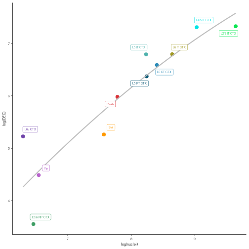
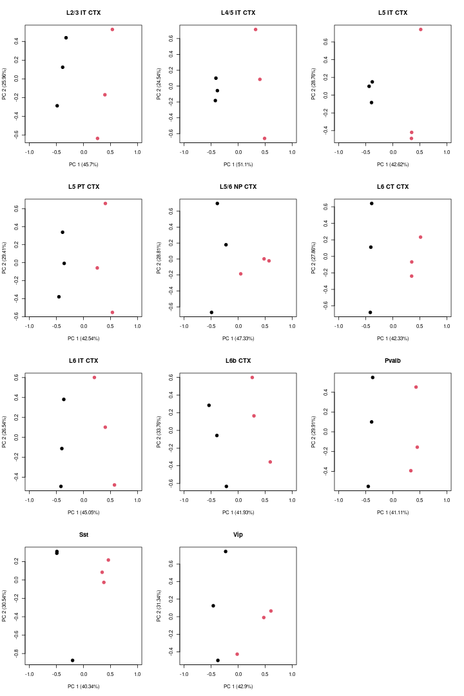
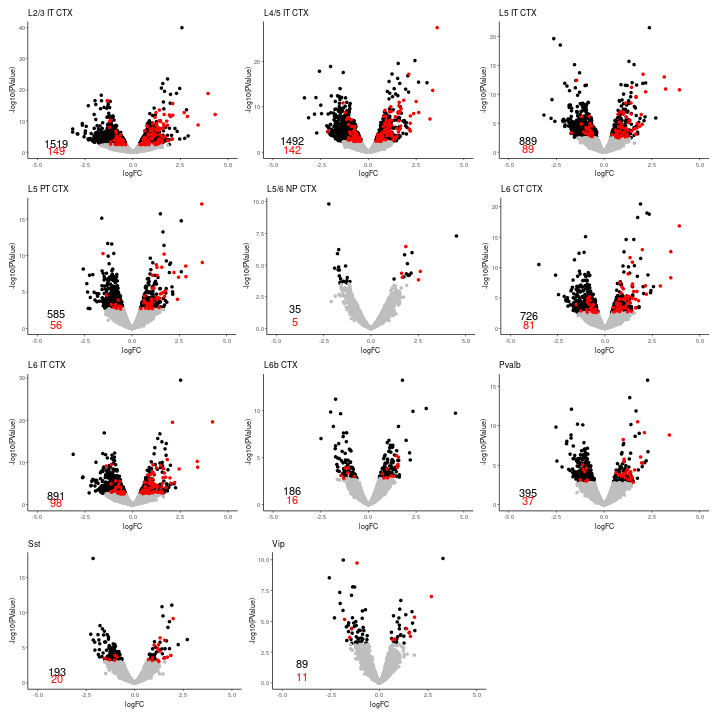
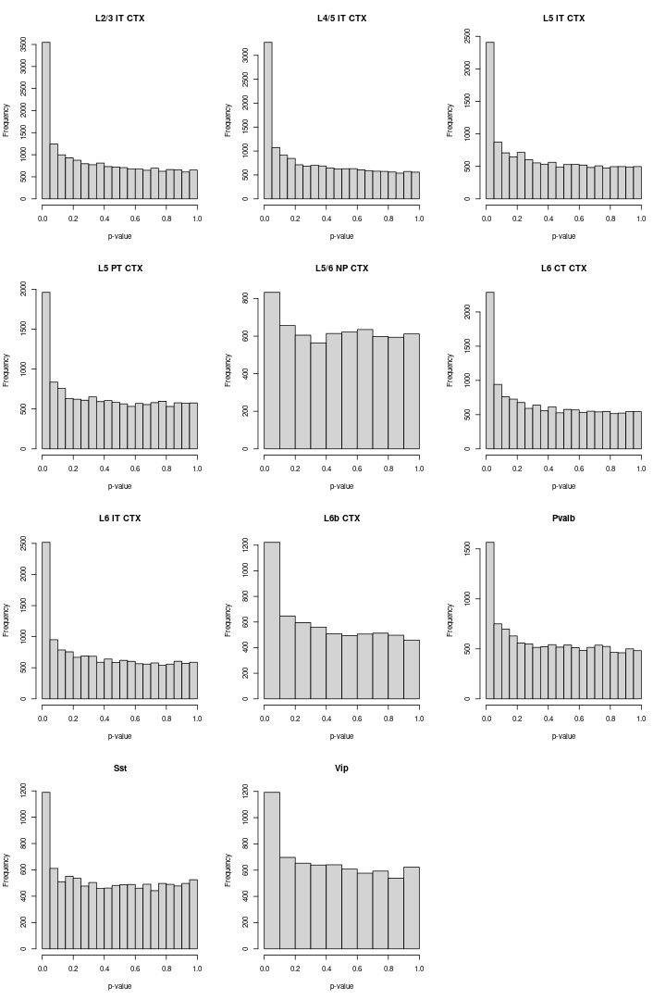
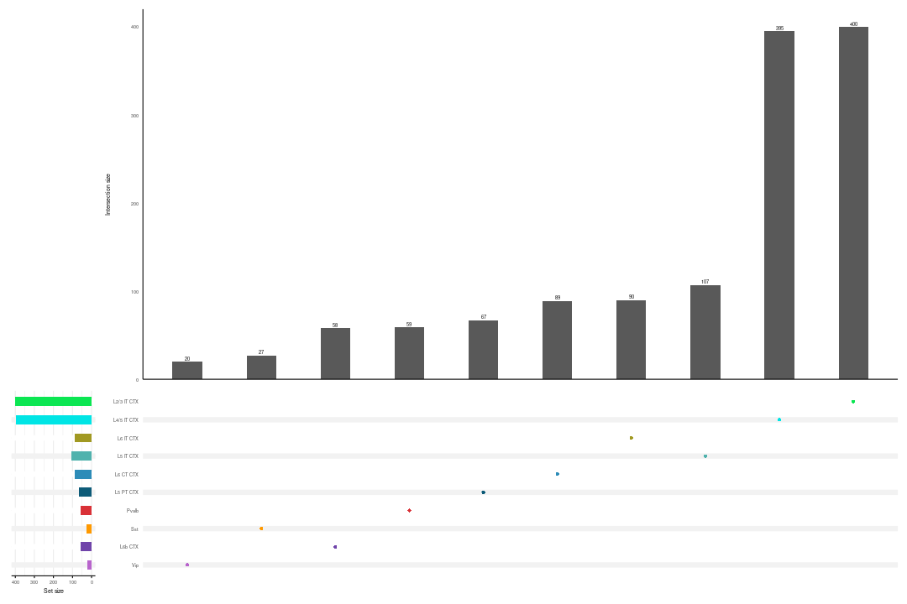

# Preliminaries

## Data Availability

Raw sequencing data for this analysis is stored in GEO under accession number [GSE211088](https://www.ncbi.nlm.nih.gov/geo/query/acc.cgi?acc=GSE211088). 

The code used in this analysis has been deposited into Github, and can be available [here](https://github.com/PeixotoLab/RNAseq_sleep/tree/main/02_analysis_snrnaseq).

## Bioconductor packages


The differential expression (DE) analysis was carried out with *[edgeR](https://bioconductor.org/packages/3.16/edgeR)*. Remove Unwanted Variation (RUV) normalization is implemented in the *[RUVSeq](https://bioconductor.org/packages/3.16/RUVSeq)* package. To normalize raw data before RUV and to visualize the Principal Component Analysis (PCA) of UQ + RUV normalization, we used the *[EDASeq](https://bioconductor.org/packages/3.16/EDASeq)* package. Some plots were visualized using the [*ggplot2*](https://cran.r-project.org/web/packages/ggplot2/index.html) package. The Upset plot was visualized using the [*UpSetR*](https://cran.r-project.org/web/packages/UpSetR/index.html) and the [*ComplexUpset*](https://cran.r-project.org/web/packages/ComplexUpset/index.html) packages.


```r
library(SingleCellExperiment)
library(scuttle)
library(edgeR)
library(RUVSeq)
library(ggplot2)
library(EDASeq)
library(ggrepel)
library(UpSetR)
library(ComplexUpset)
library(patchwork)
```

# Differential expression analysis

For each neuronal cell-type with more than 500 cells, the differential gene expression analysis was carried out with a negative binomial generalized linear model (GLM) on pseudo-bulk samples.

## Load data


```r
# Load pseudo-bulk data
url <- "https://zenodo.org/records/10091236/files/snrna_pb.rds"
system(paste0("curl ", url, " -o snrna_pb.rds"))
pb <- readRDS("snrna_pb.rds")
```


```r
# For the differential expression analysis, we selected the
# neuronal labels
pb <- pb[, pb$class == "Glutamatergic" | pb$class == "GABAergic"]

# Create a list of pseudo-bulk for each cell-type
pb_ct <- lapply(unique(pb$azimuth_labels), function(ct) pb[, pb$azimuth_labels ==
    ct])
```

## UQ + RUV

Then, we normalized the raw counts with the upper-quartile method, using the *betweenLaneNormalization* function of the EDASeq package with option *which="upper"*.
To account for latent confounders, we computed a factor of unwanted variation on the normalized data, using the *RUVs* function of the RUVSeq package with k=2 and using as negative control genes a list of genes previously characterized as non-differential in sleep deprivation in a large [microarray meta-analysis](https://bmcgenomics.biomedcentral.com/articles/10.1186/s12864-016-3065-8). Specifically, 10% of negative control genes were randomly selected to be used for evaluation and  the remaining control genes were used to fit RUV normalization. 


```r
# UQ + RUV normalization
neg_ctrl <- read.table("SD_Negative_Controls.txt")
# The 10% of meta-analysis negative control genes were randomly
# selected.
set.seed(23)
random_ng <- sample(neg_ctrl$x, round(length(neg_ctrl$x) * 0.1))
# The remaining control genes were used to fit RUV
# normalization.
neg_ctrl <- neg_ctrl[!(neg_ctrl$x %in% random_ng), ]
neg_ctrl <- intersect(rownames(pb), neg_ctrl)

# UQ normalization
ct_counts <- lapply(pb_ct, function(x) as.matrix(counts(x)))
uq <- lapply(ct_counts, function(u) betweenLaneNormalization(u, which = "upper"))

# RUV normalization
ruv2_expr_data <- ruv2_w <- list()
for (i in seq_along(unique(pb$azimuth_labels))) {
    # A matrix specifying the replicates constructed
    groups <- makeGroups(pb_ct[[i]]$condition)

    # The matrix of normalized counts was saved in a list object
    ruv2_expr_data[[i]] <- RUVs(uq[[i]], cIdx = neg_ctrl, scIdx = groups,
        k = 2)
    # The factors of unwanted variation were saved in a list
    # object
    ruv2_w[[i]] <- ruv2_expr_data[[i]]$W
}
```

## Differentially expressed genes identification

We then used the Bioconductor edgeR package to perform differential expression after filtering the lowly expressed genes with the *filterByExpr* function (with default parameters). The factor of unwanted variation was added in the design matrix. The differential gene expression analysis was computed with the function glmLRT by specifying “SD-HC” (Sleep Deprived vs Home Cage Control) as contrast and offset term equal to zero, since normalization was already carried out by the RUV factor.


```r
res_uq_ruv2 <- df_uq_ruv2 <- list()
for (i in seq_along(unique(pb$azimuth_labels))) {
    y <- DGEList(counts(pb_ct[[i]]), samples = colData(pb_ct[[i]]))

    # The genes were filtered for each cell-type
    keep <- filterByExpr(y, group = pb_ct[[i]]$condition)
    y <- y[keep, ]
    # Upper-quartile normalization
    y <- calcNormFactors(y, method = "upperquartile")

    # Design Matrix
    design <- model.matrix(~0 + y$samples$condition + ruv2_w[[i]],
        y$samples)
    colnames(design) <- c("HC", "SD", "W_1", "W_2")

    y <- estimateDisp(y, design)

    fit <- glmFit(y, design)

    # Contrast creation (SD vs HC)
    contrast <- makeContrasts(SD - HC, levels = design)

    res_uq_ruv2[[i]] <- glmLRT(fit, contrast = contrast)

    df_uq_ruv2[[i]] <- as.data.frame(res_uq_ruv2[[i]]$table)
    df_uq_ruv2[[i]] <- df_uq_ruv2[[i]][order(df_uq_ruv2[[i]]$PValue),
        ]

    FDR <- as.data.frame(topTags(res_uq_ruv2[[i]], n = length(rownames(pb)))[,
        5])

    df_uq_ruv2[[i]] <- cbind(df_uq_ruv2[[i]], FDR)
    df_uq_ruv2[[i]] <- df_uq_ruv2[[i]][order(df_uq_ruv2[[i]]$FDR),
        ]
}
names(df_uq_ruv2) <- unique(pb$azimuth_labels)
```

### Results

We used the Benjamini-Hochberg procedure to control for the false discovery rate (FDR), i.e., we considered as differentially expressed those genes that had an adjusted p-value less than 5%.


```r
# N. of nuclei
n_nuclei <- matrix(pb$ncells, 11, 6, byrow = TRUE)
n_nuclei <- rowSums(n_nuclei)

# DEA results for differentially expressed genes were selected
df_degs <- lapply(df_uq_ruv2, function(u) u[u$FDR < 0.05, ])

# N. of DEGs
n_degs <- lapply(df_degs, function(u) length(rownames(u)))

posctrl <- read.table("Additional_File2_Positive_Controls.txt", header = TRUE)
# N. of DE positive control genes
n_de_posctrl <- lapply(df_degs, function(u) length(intersect(rownames(u),
    posctrl$Gene_ID)))
```

#### Scatter plot

We visualized the scatter plot of the logarithm of the number of nuclei and the logarithm of the number of differential genes expressed.


```r
label_color <- c("Astro", "Car3", "Endo", "L2/3 IT CTX", "L4/5 IT CTX",
    "L5 IT CTX", "L5 PT CTX", "L5/6 NP CTX", "L6 CT CTX", "L6 IT CTX",
    "L6b CTX", "Lamp5", "Micro-PVM", "Oligo", "Pvalb", "SMC-Peri",
    "Sncg", "Sst", "Sst Chodl", "Vip", "VLMC")

subclass_color <- c("#957b46", "#5100FF", "#c95f3f", "#0BE652", "#00E5E5",
    "#50B2AD", "#0D5B78", "#3E9E64", "#2D8CB8", "#A19922", "#7044AA",
    "#DA808C", "#94AF97", "#744700", "#D93137", "#4c1130", "#ffff00",
    "#FF9900", "#B1B10C", "#B864CC", "#a9bd4f")

names(subclass_color) <- label_color

subclass_color <- data.frame(subclass_color)
subclass_color$Label <- rownames(subclass_color)
colnames(subclass_color) <- c("color", "Label")
rm_labels <- subclass_color[rownames(subclass_color) %in% intersect(rownames(subclass_color),
    levels(factor(pb$azimuth_labels))), ]

neuronal_color <- rm_labels$color
names(neuronal_color) <- rm_labels$Label

tab <- as.data.frame(cbind(n_nuclei, as.matrix(n_degs)))
colnames(tab) <- c("nuclei", "DEG")
tab$Label <- levels(factor(pb$azimuth_labels))
tab$DEG <- as.numeric(tab$DEG)
tab$nuclei <- as.numeric(tab$nuclei)

# Scatter plot of log(nuclei) vs log(DEGs)
ggplot(tab, aes(x = log(nuclei), y = log(DEG))) + geom_point(aes(color = Label),
    size = 3) + scale_color_manual(values = neuronal_color) + theme_classic() +
    theme(legend.position = "none", axis.text = element_text(size = 7),
        axis.title = element_text(size = 7)) + stat_smooth(method = "lm",
    formula = y ~ poly(x, 2), se = FALSE, col = "grey") + geom_label_repel(aes(label = Label),
    size = 2, box.padding = 0.5, point.padding = 0, segment.color = "grey50",
    min.segment.length = unit(1.5, "lines"), colour = neuronal_color)
```



#### PCA

Then, we visualized the PCA for each cell-type.


```r
label <- levels(factor(pb$azimuth_labels))
set_ct <- lapply(pb_ct, function(u) newSeqExpressionSet(as.matrix(round(counts(u))),
    phenoData = data.frame(colData(u), row.names = colnames(u))))
set_ct <- lapply(set_ct, function(u) betweenLaneNormalization(u, which = "upper"))

set_ruv2 <- list()
for (i in seq_along(unique(pb$azimuth_labels))) {
    # A matrix specifying the replicates constructed
    groups <- makeGroups(pb_ct[[i]]$condition)

    # k = 2 The matrix of normalized counts was saved in a list
    # object
    set_ruv2[[i]] <- RUVs(set_ct[[i]], cIdx = neg_ctrl, scIdx = groups,
        k = 2)

}
```


```r
par(mfrow = c(4, 3))
for (i in seq_along(label)) {
    plotPCA(set_ruv2[[i]], xlim = c(-1, 1), label = FALSE, pch = 20,
        theme_size = 7, col = as.numeric(as.factor(set_ruv2[[i]]$condition)),
        cex = 2, main = paste(label[i], sep = " "))
}
```



#### Volcano plot

We visualized the volcano plot and histogram for each cell-type.


```r
## Volcano plot of all cell-types
for (i in seq_along(df_uq_ruv2)) {
    df_uq_ruv2[[i]]$Significance <- "No Significant"
    df_uq_ruv2[[i]]$Significance[df_uq_ruv2[[i]]$FDR < 0.05] <- "Significant"
    inter <- intersect(rownames(df_uq_ruv2[[i]][df_uq_ruv2[[i]]$FDR <
        0.05, ]), posctrl$Gene_ID)
    df_uq_ruv2[[i]]$Significance[rownames(df_uq_ruv2[[i]]) %in% inter] <- "SignificantPos"
}

p1 <- ggplot(data = df_uq_ruv2[[1]], aes(x = logFC, y = -log10(PValue),
    col = Significance)) + geom_point(data = df_uq_ruv2[[1]][(df_uq_ruv2[[1]]$Significance ==
    "Significant" | df_uq_ruv2[[1]]$Significance == "No Significant"),
    ], size = 1) + geom_point(data = df_uq_ruv2[[1]][df_uq_ruv2[[1]]$Significance ==
    "SignificantPos", ], size = 1) + xlim(-5, 5) + theme_classic(base_size = 7) +
    theme(legend.position = "none") + scale_color_manual(values = c(Significant = "black",
    `No Significant` = "grey", SignificantPos = "red")) + ggtitle("L2/3 IT CTX") +
    annotate("text", x = -4, y = 2.5, label = n_degs[[1]]) + annotate("text",
    x = -4, y = 0.5, label = n_de_posctrl[[1]], color = "red")

p2 <- ggplot(data = df_uq_ruv2[[2]], aes(x = logFC, y = -log10(PValue),
    col = Significance)) + geom_point(data = df_uq_ruv2[[2]][(df_uq_ruv2[[2]]$Significance ==
    "Significant" | df_uq_ruv2[[2]]$Significance == "No Significant"),
    ], size = 1) + geom_point(data = df_uq_ruv2[[2]][df_uq_ruv2[[2]]$Significance ==
    "SignificantPos", ], size = 1) + xlim(-5, 5) + theme_classic(base_size = 7) +
    theme(legend.position = "none") + scale_color_manual(values = c(Significant = "black",
    `No Significant` = "grey", SignificantPos = "red")) + ggtitle("L4/5 IT CTX") +
    annotate("text", x = -4, y = 2.5, label = n_degs[[2]]) + annotate("text",
    x = -4, y = 0.5, label = n_de_posctrl[[2]], color = "red")

p3 <- ggplot(data = df_uq_ruv2[[3]], aes(x = logFC, y = -log10(PValue),
    col = Significance)) + geom_point(data = df_uq_ruv2[[3]][(df_uq_ruv2[[3]]$Significance ==
    "Significant" | df_uq_ruv2[[3]]$Significance == "No Significant"),
    ], size = 1) + geom_point(data = df_uq_ruv2[[3]][df_uq_ruv2[[3]]$Significance ==
    "SignificantPos", ], size = 1) + xlim(-5, 5) + theme_classic(base_size = 7) +
    theme(legend.position = "none") + scale_color_manual(values = c(Significant = "black",
    `No Significant` = "grey", SignificantPos = "red")) + ggtitle("L5 IT CTX") +
    annotate("text", x = -4, y = 2, label = n_degs[[3]]) + annotate("text",
    x = -4, y = 0.5, label = n_de_posctrl[[3]], color = "red")

p4 <- ggplot(data = df_uq_ruv2[[4]], aes(x = logFC, y = -log10(PValue),
    col = Significance)) + geom_point(data = df_uq_ruv2[[4]][(df_uq_ruv2[[4]]$Significance ==
    "Significant" | df_uq_ruv2[[4]]$Significance == "No Significant"),
    ], size = 1) + geom_point(data = df_uq_ruv2[[4]][df_uq_ruv2[[4]]$Significance ==
    "SignificantPos", ], size = 1) + xlim(-5, 5) + theme_classic(base_size = 7) +
    theme(legend.position = "none") + scale_color_manual(values = c(Significant = "black",
    `No Significant` = "grey", SignificantPos = "red")) + ggtitle("L5 PT CTX") +
    annotate("text", x = -4, y = 2, label = n_degs[[4]]) + annotate("text",
    x = -4, y = 0.5, label = n_de_posctrl[[4]], color = "red")

p5 <- ggplot(data = df_uq_ruv2[[5]], aes(x = logFC, y = -log10(PValue),
    col = Significance)) + geom_point(data = df_uq_ruv2[[5]][(df_uq_ruv2[[5]]$Significance ==
    "Significant" | df_uq_ruv2[[5]]$Significance == "No Significant"),
    ], size = 1) + geom_point(data = df_uq_ruv2[[5]][df_uq_ruv2[[5]]$Significance ==
    "SignificantPos", ], size = 1) + xlim(-5, 5) + theme_classic(base_size = 7) +
    theme(legend.position = "none") + scale_color_manual(values = c(Significant = "black",
    `No Significant` = "grey", SignificantPos = "red")) + ggtitle("L5/6 NP CTX") +
    annotate("text", x = -4, y = 1.5, label = n_degs[[5]]) + annotate("text",
    x = -4, y = 0.5, label = n_de_posctrl[[5]], color = "red")

p6 <- ggplot(data = df_uq_ruv2[[6]], aes(x = logFC, y = -log10(PValue),
    col = Significance)) + geom_point(data = df_uq_ruv2[[6]][(df_uq_ruv2[[6]]$Significance ==
    "Significant" | df_uq_ruv2[[6]]$Significance == "No Significant"),
    ], size = 1) + geom_point(data = df_uq_ruv2[[6]][df_uq_ruv2[[6]]$Significance ==
    "SignificantPos", ], size = 1) + xlim(-5, 5) + theme_classic(base_size = 7) +
    theme(legend.position = "none") + scale_color_manual(values = c(Significant = "black",
    `No Significant` = "grey", SignificantPos = "red")) + ggtitle("L6 CT CTX") +
    annotate("text", x = -4, y = 2, label = n_degs[[6]]) + annotate("text",
    x = -4, y = 0.5, label = n_de_posctrl[[6]], color = "red")

p7 <- ggplot(data = df_uq_ruv2[[7]], aes(x = logFC, y = -log10(PValue),
    col = Significance)) + geom_point(data = df_uq_ruv2[[7]][(df_uq_ruv2[[7]]$Significance ==
    "Significant" | df_uq_ruv2[[7]]$Significance == "No Significant"),
    ], size = 1) + geom_point(data = df_uq_ruv2[[7]][df_uq_ruv2[[7]]$Significance ==
    "SignificantPos", ], size = 1) + xlim(-5, 5) + theme_classic(base_size = 7) +
    theme(legend.position = "none") + scale_color_manual(values = c(Significant = "black",
    `No Significant` = "grey", SignificantPos = "red")) + ggtitle("L6 IT CTX") +
    annotate("text", x = -4, y = 2, label = n_degs[[7]]) + annotate("text",
    x = -4, y = 0.5, label = n_de_posctrl[[7]], color = "red")

p8 <- ggplot(data = df_uq_ruv2[[8]], aes(x = logFC, y = -log10(PValue),
    col = Significance)) + geom_point(data = df_uq_ruv2[[8]][(df_uq_ruv2[[8]]$Significance ==
    "Significant" | df_uq_ruv2[[8]]$Significance == "No Significant"),
    ], size = 1) + geom_point(data = df_uq_ruv2[[8]][df_uq_ruv2[[8]]$Significance ==
    "SignificantPos", ], size = 1) + xlim(-5, 5) + theme_classic(base_size = 7) +
    theme(legend.position = "none") + scale_color_manual(values = c(Significant = "black",
    `No Significant` = "grey", SignificantPos = "red")) + ggtitle("L6b CTX") +
    annotate("text", x = -4, y = 1.5, label = n_degs[[8]]) + annotate("text",
    x = -4, y = 0.5, label = n_de_posctrl[[8]], color = "red")

p9 <- ggplot(data = df_uq_ruv2[[9]], aes(x = logFC, y = -log10(PValue),
    col = Significance)) + geom_point(data = df_uq_ruv2[[9]][(df_uq_ruv2[[9]]$Significance ==
    "Significant" | df_uq_ruv2[[9]]$Significance == "No Significant"),
    ], size = 1) + geom_point(data = df_uq_ruv2[[9]][df_uq_ruv2[[9]]$Significance ==
    "SignificantPos", ], size = 1) + xlim(-5, 5) + theme_classic(base_size = 7) +
    theme(legend.position = "none") + scale_color_manual(values = c(Significant = "black",
    `No Significant` = "grey", SignificantPos = "red")) + ggtitle("Pvalb") +
    annotate("text", x = -4, y = 1.5, label = n_degs[[9]]) + annotate("text",
    x = -4, y = 0.5, label = n_de_posctrl[[9]], color = "red")

p10 <- ggplot(data = df_uq_ruv2[[10]], aes(x = logFC, y = -log10(PValue),
    col = Significance)) + geom_point(data = df_uq_ruv2[[10]][(df_uq_ruv2[[10]]$Significance ==
    "Significant" | df_uq_ruv2[[10]]$Significance == "No Significant"),
    ], size = 1) + geom_point(data = df_uq_ruv2[[10]][df_uq_ruv2[[10]]$Significance ==
    "SignificantPos", ], size = 1) + xlim(-5, 5) + theme_classic(base_size = 7) +
    theme(legend.position = "none") + scale_color_manual(values = c(Significant = "black",
    `No Significant` = "grey", SignificantPos = "red")) + ggtitle("Sst") +
    annotate("text", x = -4, y = 1.5, label = n_degs[[10]]) + annotate("text",
    x = -4, y = 0.5, label = n_de_posctrl[[10]], color = "red")

p11 <- ggplot(data = df_uq_ruv2[[11]], aes(x = logFC, y = -log10(PValue),
    col = Significance)) + geom_point(data = df_uq_ruv2[[11]][(df_uq_ruv2[[11]]$Significance ==
    "Significant" | df_uq_ruv2[[11]]$Significance == "No Significant"),
    ], size = 1) + geom_point(data = df_uq_ruv2[[11]][df_uq_ruv2[[11]]$Significance ==
    "SignificantPos", ], size = 1) + xlim(-5, 5) + theme_classic(base_size = 7) +
    theme(legend.position = "none") + scale_color_manual(values = c(Significant = "black",
    `No Significant` = "grey", SignificantPos = "red")) + ggtitle("Vip") +
    annotate("text", x = -4, y = 1.5, label = n_degs[[11]]) + annotate("text",
    x = -4, y = 0.5, label = n_de_posctrl[[11]], color = "red")

# Blank space
p12 <- ggplot(data = df_uq_ruv2[[11]], aes(x = logFC, y = -log10(PValue),
    col = Significance)) + xlim(-5, 5) + theme_classic(base_size = 7) +
    theme(legend.position = "none")

(p1 | p2 | p3)/(p4 | p5 | p6)/(p7 | p8 | p9)/(p10 | p11 | plot_spacer())
```



#### Histogram of p-value distribution


```r
# Histogram of p-value distribution
label <- unique(pb$azimuth_labels)

par(mfrow = c(4, 3))
for (i in seq_along(label)) {
    hist(df_uq_ruv2[[i]]$PValue, xlab = "p-value", main = paste(label[i],
        sep = " "))
}
```



# Upset plot

For Glutamatergic and GABAergic neurons, we used the *upset* function of the UpSetR package to identify the list of unique differentially expression genes for each cell-type.


```r
df_degs <- lapply(df_uq_ruv2, function(u) rownames(u[u$FDR < 0.05, ]))

# Since the p-value distribution wasn't good, the L6b CTX label was removed
ll <- list("L2/3 IT CTX" = df_degs[[1]], "L4/5 IT CTX" = df_degs[[2]],
           "L5 IT CTX" = df_degs[[3]], "L5 PT CTX" = df_degs[[4]],
           "L6 CT CTX" = df_degs[[6]], "L6 IT CTX" = df_degs[[7]],
           "L6b CTX" = df_degs[[8]],
           "Pvalb" = df_degs[[9]], "Sst" = df_degs[[10]], "Vip" = df_degs[[11]])

df.edgeRList <- fromList(ll)

upset(df.edgeRList, colnames(df.edgeRList)[1:10],
      sort_intersections_by = c("degree", "cardinality"),
      sort_intersections = "ascending",
      name = "", width_ratio = 0.1, keep_empty_groups = TRUE,
      queries = list(
        upset_query(set = "L2/3 IT CTX", fill = "#0BE652"),
        upset_query(set = "L4/5 IT CTX", fill = "#00E5E5"),
        upset_query(set = "L5 IT CTX", fill = "#50B2AD"),
        upset_query(set = "L5 PT CTX", fill = "#0D5B78"),
        upset_query(set = "L6 CT CTX", fill = "#2D8CB8"),
        upset_query(set = "L6 IT CTX", fill = "#A19922"),
        upset_query(set = "L6b CTX", fill = "#7044AA"),
        upset_query(set = "Pvalb", fill = "#D93137"),
        upset_query(set = "Sst", fill = "#FF9900"),
        upset_query(set = "Vip", fill = "#B864CC")
      ),
      intersections = list(
        # Unique DEGs were visualized for each cell-type
        "L2/3 IT CTX", "L4/5 IT CTX", "L5 IT CTX", "L5 PT CTX",
        "L6 CT CTX", "L6 IT CTX", "L6b CTX", "Pvalb", "Sst", "Vip"
      ),
      base_annotations = list(
        "Intersection size" = (
          intersection_size(
            bar_number_threshold = 1, # show all numbers on top of bars
            width = 0.4,  # reduce width of the bars
            text = list(size = 2)
          )
          # add some space on the top of the bars
          + scale_y_continuous(expand = expansion(mult = c(0, 0.05)))
          + theme(
            # hide grid lines
            panel.grid.major = element_blank(),
            panel.grid.minor = element_blank(),
            # show axis lines
            axis.line = element_line(colour = "black")
          )
        )
      ),
      stripes = upset_stripes(
        geom = geom_segment(size = 3),
        colors = c("grey95", "white")
      ),
      matrix = intersection_matrix(
        geom = geom_point(
          shape = "circle filled",
          size = 2,
          stroke = 0
        )
      ),
      set_sizes = (
        upset_set_size(geom = geom_bar(width = 0.5), filter_intersections = TRUE)
        + theme(
          axis.line.x = element_line(colour = "black"),
          axis.ticks.x = element_line()
        )
      ),
      themes = upset_default_themes(text = element_text(size = 7, color = "black"))) +
  theme(plot.background = element_blank(),
        panel.grid.major = element_blank(),
        panel.grid.minor = element_blank(),
        panel.border = element_blank())
```



## Session Info


```r
sessionInfo()
```

```
## R version 4.2.0 (2022-04-22)
## Platform: x86_64-pc-linux-gnu (64-bit)
## Running under: Ubuntu 20.04.4 LTS
## 
## Matrix products: default
## BLAS:   /usr/lib/x86_64-linux-gnu/blas/libblas.so.3.9.0
## LAPACK: /usr/lib/x86_64-linux-gnu/lapack/liblapack.so.3.9.0
## 
## locale:
##  [1] LC_CTYPE=en_US.UTF-8       LC_NUMERIC=C              
##  [3] LC_TIME=en_US.UTF-8        LC_COLLATE=en_US.UTF-8    
##  [5] LC_MONETARY=en_US.UTF-8    LC_MESSAGES=en_US.UTF-8   
##  [7] LC_PAPER=en_US.UTF-8       LC_NAME=C                 
##  [9] LC_ADDRESS=C               LC_TELEPHONE=C            
## [11] LC_MEASUREMENT=en_US.UTF-8 LC_IDENTIFICATION=C       
## 
## attached base packages:
## [1] stats4    stats     graphics  grDevices utils     datasets 
## [7] methods   base     
## 
## other attached packages:
##  [1] patchwork_1.1.2                
##  [2] ComplexUpset_1.3.3             
##  [3] UpSetR_1.4.0                   
##  [4] ggrepel_0.9.3                  
##  [5] RUVSeq_1.32.0                  
##  [6] EDASeq_2.32.0                  
##  [7] ShortRead_1.56.1               
##  [8] GenomicAlignments_1.34.0       
##  [9] Rsamtools_2.14.0               
## [10] Biostrings_2.66.0              
## [11] XVector_0.38.0                 
## [12] BiocParallel_1.32.5            
## [13] GEOquery_2.66.0                
## [14] BiocManager_1.30.19            
## [15] knitr_1.42                     
## [16] BiocStyle_2.26.0               
## [17] rmarkdown_2.20                 
## [18] dplyr_1.0.10                   
## [19] AllenInstituteBrainData_0.99.1 
## [20] edgeR_3.40.2                   
## [21] limma_3.54.1                   
## [22] muscat_1.12.1                  
## [23] biomaRt_2.54.0                 
## [24] ggplot2_3.3.6                  
## [25] pbmcsca.SeuratData_3.0.0       
## [26] mousecortexref.SeuratData_1.0.0
## [27] SeuratData_0.2.2               
## [28] Azimuth_0.4.6                  
## [29] shinyBS_0.61.1                 
## [30] SeuratObject_4.1.3             
## [31] Seurat_4.3.0                   
## [32] scDblFinder_1.12.0             
## [33] scran_1.26.2                   
## [34] scuttle_1.8.4                  
## [35] EnsDb.Mmusculus.v79_2.99.0     
## [36] ensembldb_2.22.0               
## [37] AnnotationFilter_1.22.0        
## [38] GenomicFeatures_1.50.4         
## [39] AnnotationDbi_1.60.0           
## [40] SingleCellExperiment_1.20.0    
## [41] SummarizedExperiment_1.28.0    
## [42] Biobase_2.58.0                 
## [43] GenomicRanges_1.50.2           
## [44] GenomeInfoDb_1.34.9            
## [45] IRanges_2.32.0                 
## [46] S4Vectors_0.36.1               
## [47] BiocGenerics_0.44.0            
## [48] MatrixGenerics_1.10.0          
## [49] matrixStats_0.63.0             
## 
## loaded via a namespace (and not attached):
##   [1] rsvd_1.0.5                ica_1.0-3                
##   [3] ps_1.7.2                  rprojroot_2.0.3          
##   [5] foreach_1.5.2             lmtest_0.9-40            
##   [7] crayon_1.5.2              rbibutils_2.2.13         
##   [9] MASS_7.3-58.2             rhdf5filters_1.10.0      
##  [11] nlme_3.1-162              backports_1.4.1          
##  [13] rlang_1.0.6               ROCR_1.0-11              
##  [15] irlba_2.3.5.1             callr_3.7.3              
##  [17] nloptr_2.0.3              scater_1.26.1            
##  [19] filelock_1.0.2            xgboost_1.7.3.1          
##  [21] rjson_0.2.21              bit64_4.0.5              
##  [23] glue_1.6.2                sctransform_0.3.5        
##  [25] processx_3.8.0            pbkrtest_0.5.2           
##  [27] parallel_4.2.0            vipor_0.4.5              
##  [29] spatstat.sparse_3.0-0     SeuratDisk_0.0.0.9020    
##  [31] shinydashboard_0.7.2      spatstat.geom_3.0-6      
##  [33] tidyselect_1.2.0          usethis_2.1.6            
##  [35] fitdistrplus_1.1-8        variancePartition_1.28.4 
##  [37] XML_3.99-0.13             tidyr_1.2.1              
##  [39] zoo_1.8-11                xtable_1.8-4             
##  [41] magrittr_2.0.3            evaluate_0.20            
##  [43] Rdpack_2.4                cli_3.6.0                
##  [45] zlibbioc_1.44.0           hwriter_1.3.2.1          
##  [47] miniUI_0.1.1.1            sp_1.6-0                 
##  [49] aod_1.3.2                 tinytex_0.44             
##  [51] shiny_1.7.4               BiocSingular_1.14.0      
##  [53] xfun_0.37                 clue_0.3-64              
##  [55] pkgbuild_1.4.0            cluster_2.1.4            
##  [57] caTools_1.18.2            KEGGREST_1.38.0          
##  [59] clusterGeneration_1.3.7   tibble_3.1.8             
##  [61] listenv_0.9.0             png_0.1-8                
##  [63] future_1.31.0             withr_2.5.0              
##  [65] bitops_1.0-7              plyr_1.8.8               
##  [67] cellranger_1.1.0          dqrng_0.3.0              
##  [69] pillar_1.8.1              gplots_3.1.3             
##  [71] GlobalOptions_0.1.2       cachem_1.0.6             
##  [73] fs_1.6.1                  hdf5r_1.3.8              
##  [75] GetoptLong_1.0.5          RUnit_0.4.32             
##  [77] DelayedMatrixStats_1.20.0 vctrs_0.4.1              
##  [79] ellipsis_0.3.2            generics_0.1.3           
##  [81] devtools_2.4.5            tools_4.2.0              
##  [83] remaCor_0.0.11            beeswarm_0.4.0           
##  [85] munsell_0.5.0             DelayedArray_0.24.0      
##  [87] pkgload_1.3.2             fastmap_1.1.0            
##  [89] compiler_4.2.0            abind_1.4-5              
##  [91] httpuv_1.6.8              rtracklayer_1.58.0       
##  [93] sessioninfo_1.2.2         plotly_4.10.1            
##  [95] GenomeInfoDbData_1.2.9    gridExtra_2.3            
##  [97] glmmTMB_1.1.5             lattice_0.20-45          
##  [99] deldir_1.0-6              utf8_1.2.3               
## [101] later_1.3.0               BiocFileCache_2.6.0      
## [103] jsonlite_1.8.4            scales_1.2.1             
## [105] ScaledMatrix_1.6.0        pbapply_1.7-0            
## [107] sparseMatrixStats_1.10.0  lazyeval_0.2.2           
## [109] promises_1.2.0.1          doParallel_1.0.17        
## [111] R.utils_2.12.2            latticeExtra_0.6-30      
## [113] goftest_1.2-3             spatstat.utils_3.0-1     
## [115] reticulate_1.28           cowplot_1.1.1            
## [117] blme_1.0-5                statmod_1.5.0            
## [119] Rtsne_0.16                uwot_0.1.14              
## [121] igraph_1.4.0              HDF5Array_1.26.0         
## [123] survival_3.5-0            numDeriv_2016.8-1.1      
## [125] yaml_2.3.7                htmltools_0.5.4          
## [127] memoise_2.0.1             profvis_0.3.7            
## [129] BiocIO_1.8.0              locfit_1.5-9.7           
## [131] viridisLite_0.4.1         digest_0.6.31            
## [133] assertthat_0.2.1          RhpcBLASctl_0.21-247.1   
## [135] mime_0.12                 rappdirs_0.3.3           
## [137] RSQLite_2.2.20            future.apply_1.10.0      
## [139] remotes_2.4.2             data.table_1.14.6        
## [141] urlchecker_1.0.1          blob_1.2.3               
## [143] R.oo_1.25.0               labeling_0.4.2           
## [145] splines_4.2.0             Rhdf5lib_1.20.0          
## [147] googledrive_2.0.0         ProtGenerics_1.30.0      
## [149] RCurl_1.98-1.10           broom_1.0.3              
## [151] hms_1.1.2                 rhdf5_2.42.0             
## [153] colorspace_2.1-0          ggbeeswarm_0.7.1         
## [155] shape_1.4.6               Rcpp_1.0.10              
## [157] RANN_2.6.1                mvtnorm_1.1-3            
## [159] circlize_0.4.15           fansi_1.0.4              
## [161] tzdb_0.3.0                parallelly_1.34.0        
## [163] R6_2.5.1                  grid_4.2.0               
## [165] ggridges_0.5.4            lifecycle_1.0.3          
## [167] formatR_1.14              bluster_1.8.0            
## [169] curl_5.0.0                googlesheets4_1.0.1      
## [171] minqa_1.2.5               leiden_0.4.3             
## [173] Matrix_1.5-3              desc_1.4.2               
## [175] RcppAnnoy_0.0.20          RColorBrewer_1.1-3       
## [177] iterators_1.0.14          spatstat.explore_3.0-6   
## [179] TMB_1.9.2                 stringr_1.5.0            
## [181] htmlwidgets_1.6.1         beachmat_2.14.0          
## [183] polyclip_1.10-4           purrr_0.3.5              
## [185] mgcv_1.8-41               ComplexHeatmap_2.14.0    
## [187] globals_0.16.2            spatstat.random_3.1-3    
## [189] progressr_0.13.0          codetools_0.2-19         
## [191] metapod_1.6.0             gtools_3.9.4             
## [193] prettyunits_1.1.1         dbplyr_2.3.0             
## [195] R.methodsS3_1.8.2         gtable_0.3.1             
## [197] DBI_1.1.3                 aroma.light_3.28.0       
## [199] highr_0.10                tensor_1.5               
## [201] httr_1.4.4                KernSmooth_2.23-20       
## [203] stringi_1.7.12            presto_1.0.0             
## [205] progress_1.2.2            farver_2.1.1             
## [207] reshape2_1.4.4            annotate_1.76.0          
## [209] viridis_0.6.2             DT_0.27                  
## [211] xml2_1.3.3                boot_1.3-28.1            
## [213] shinyjs_2.1.0             BiocNeighbors_1.16.0     
## [215] lme4_1.1-31               restfulr_0.0.15          
## [217] interp_1.1-3              readr_2.1.4              
## [219] geneplotter_1.76.0        scattermore_0.8          
## [221] DESeq2_1.38.3             bit_4.0.5                
## [223] jpeg_0.1-10               spatstat.data_3.0-0      
## [225] pkgconfig_2.0.3           gargle_1.3.0             
## [227] lmerTest_3.1-3
```
