# Differential Transcript and Differential Gene Expression using Fishpond with RUVs

## Description

Sleep deprivation (SD) has negative effects on brain function. Sleep problems are prevalent in neurodevelopmental, neurodegenerative and psychiatric disorders. Thus, understanding the molecular consequences of SD is of fundamental importance in neuroscience. In this study, we present the first simultaneous bulk and single-nuclear (sn)RNA sequencing characterization of the effects of SD in the mouse frontal cortex. We show that SD predominantly affects glutamatergic neurons, specifically in layers 4 and 5, and produces isoform switching of thousands of transcripts. At both the global and cell-type specific level, SD has a large repressive effect on transcription, down-regulating thousands of genes and transcripts; underscoring the importance of accounting for the effects of sleep loss in transcriptome studies of brain function. As a resource we provide extensive characterizations of cell types, genes, transcripts and pathways affected by SD; as well as tutorials for data analysis.


This code was adapted from the tutorial here: <https://bioconductor.org/packages/release/bioc/vignettes/fishpond/inst/doc/swish.html#Quick_start>

## Data Availability

"Raw" sequencing data for this analysis is stored in GEO under accession number [GSE211088](https://www.ncbi.nlm.nih.gov/geo/query/acc.cgi?acc=GSE211088). Additionally, the bulk files were previously published [@ingiosi2019] and can be accessed in GEO under accession number [GSE113754](https://www.ncbi.nlm.nih.gov/geo/query/acc.cgi?acc=GSE113754).

The code used in this analysis has been deposited into Github, and can be accessed via the following link: **link to github folder where this code is**

Prior to this analysis, files were quantified using *Salmon* [@patro2017] and imported into *tximeta* [@love2020] to generate a *SummarizedExperiment* object.

## Data Import

Establish the working directory using the code below. The working directory can be thought of as the default location where files can be accessed from or saved to.


```r
setwd("~/Dropbox/Sleep_RNAseq_Splicing/BulkRNAseq_SD/Final_Tximeta")
dir <- setwd("~/Dropbox/Sleep_RNAseq_Splicing/BulkRNAseq_SD/Final_Tximeta")
```

Import the colData, which contains the sample names and condition (the condition is necessary for Fishpond). In short, the colData is a file that contains descriptions of the samples, and is created during *tximeta* [@love2020]. You can see what the columns and first few rows of the file look like using the *head()* function:


```r
load(file = "coldata.rda")
head(coldata)
```

```
##                               names condition
## S3HC5_PFC_1_quant S3HC5_PFC_1_quant     S3HC5
## S3HC5_PFC_2_quant S3HC5_PFC_2_quant     S3HC5
## S3HC5_PFC_3_quant S3HC5_PFC_3_quant     S3HC5
## S3HC5_PFC_4_quant S3HC5_PFC_4_quant     S3HC5
## S3HC5_PFC_5_quant S3HC5_PFC_5_quant     S3HC5
## S3HC7_PFC_1_quant S3HC7_PFC_1_quant     S3HC7
##                                                                                                                                        files
## S3HC5_PFC_1_quant /Users/kaitlynford/Dropbox/Sleep_RNAseq_Splicing/BulkRNAseq_SD/Final_Tximeta/data/Salmon_Quants/S3HC5_PFC_1_quant/quant.sf
## S3HC5_PFC_2_quant /Users/kaitlynford/Dropbox/Sleep_RNAseq_Splicing/BulkRNAseq_SD/Final_Tximeta/data/Salmon_Quants/S3HC5_PFC_2_quant/quant.sf
## S3HC5_PFC_3_quant /Users/kaitlynford/Dropbox/Sleep_RNAseq_Splicing/BulkRNAseq_SD/Final_Tximeta/data/Salmon_Quants/S3HC5_PFC_3_quant/quant.sf
## S3HC5_PFC_4_quant /Users/kaitlynford/Dropbox/Sleep_RNAseq_Splicing/BulkRNAseq_SD/Final_Tximeta/data/Salmon_Quants/S3HC5_PFC_4_quant/quant.sf
## S3HC5_PFC_5_quant /Users/kaitlynford/Dropbox/Sleep_RNAseq_Splicing/BulkRNAseq_SD/Final_Tximeta/data/Salmon_Quants/S3HC5_PFC_5_quant/quant.sf
## S3HC7_PFC_1_quant /Users/kaitlynford/Dropbox/Sleep_RNAseq_Splicing/BulkRNAseq_SD/Final_Tximeta/data/Salmon_Quants/S3HC7_PFC_1_quant/quant.sf
```

Add a path to locate the files:


```r
coldata$files <- file.path(dir, "data/Salmon_Quants", coldata$names,
    "quant.sf")
```

Before continuing with the analysis, make sure that all files in your colData exist in this location:


```r
all(file.exists(coldata$files))
```

```
## [1] TRUE
```

Load *SummarizedExperiment* and *tximeta* packages:


```r
suppressPackageStartupMessages(library(SummarizedExperiment))  # Version 1.28.0
suppressPackageStartupMessages(library(tximeta))  # Version 1.16.1
```

Load the quantification data with *tximeta* (Here we load with an rda file):


```r
load(file = "se.rda")
```

Ensure assays are loaded by viewing *assayNames()*. Assays are experimental results, and are necessary for *fishpond*. Call *assay()* to retrieve experimental data.


```r
assayNames(se)
```

```
##  [1] "counts"    "abundance" "length"    "infRep1"   "infRep2"  
##  [6] "infRep3"   "infRep4"   "infRep5"   "infRep6"   "infRep7"  
## [11] "infRep8"   "infRep9"   "infRep10"  "infRep11"  "infRep12" 
## [16] "infRep13"  "infRep14"  "infRep15"  "infRep16"  "infRep17" 
## [21] "infRep18"  "infRep19"  "infRep20"  "infRep21"  "infRep22" 
## [26] "infRep23"  "infRep24"  "infRep25"  "infRep26"  "infRep27" 
## [31] "infRep28"  "infRep29"  "infRep30"
```

View rownames (transcript IDs) using the *head()* function:


```r
head(rownames(se))
```

```
## [1] "ENSMUST00000193812.1" "ENSMUST00000082908.1"
## [3] "ENSMUST00000162897.1" "ENSMUST00000159265.1"
## [5] "ENSMUST00000070533.4" "ENSMUST00000192857.1"
```

# Differential Transcript Expression Analysis Starts Here

'se' will be referred to as 'y' for the remainder of the analysis.


```r
y <- se
```

I will do a two group comparison between wild-type animals. Those that were left undisturbed in their home cage (HC) for 5 hours and those who were sleep sleep deprived (SD) via gentle handling for 5 hours.

The following analysis will compare the second group to the first group listed in *levels*, in this case, SD compared to HC controls.


```r
y <- y[, y$condition %in% c("WTHC5", "WTSD5")]
y$condition <- factor(y$condition, levels = c("WTHC5", "WTSD5"))
```

## Load Fishpond, and Proceed with Differential Expression Analysis

Load the *fishpond* package to proceed with differential expression analysis:


```r
suppressPackageStartupMessages(library(fishpond))  # Version 2.4.1
```

Scale inferential replicates to the mean sequencing depth. It is important to note that only the inferential replicates are scaled during this process, not the counts, which will be relevant in later steps.


```r
y <- scaleInfReps(y)
```

```
## Progress:  1 on 30  Progress:  2 on 30  Progress:  3 on 30  Progress:  4 on 30  Progress:  5 on 30  Progress:  6 on 30  Progress:  7 on 30  Progress:  8 on 30  Progress:  9 on 30  Progress: 10 on 30  Progress: 11 on 30  Progress: 12 on 30  Progress: 13 on 30  Progress: 14 on 30  Progress: 15 on 30  Progress: 16 on 30  Progress: 17 on 30  Progress: 18 on 30  Progress: 19 on 30  Progress: 20 on 30  Progress: 21 on 30  Progress: 22 on 30  Progress: 23 on 30  Progress: 24 on 30  Progress: 25 on 30  Progress: 26 on 30  Progress: 27 on 30  Progress: 28 on 30  Progress: 29 on 30  Progress: 30 on 30
```

Before filtering, we have 140,992 transcripts:


```r
dim(y)
```

```
## [1] 140992     10
```

Filter here, keeping a minimum count of 10 transcripts across a minimum of 3 replicates. In this step, we are removing most of the rows with zero to very low counts before proceeding with the analysis.


```r
y <- labelKeep(y, minCount = 10, minN = 3)
```

After filtering, we have 54,030 transcripts:


```r
y <- y[mcols(y)$keep, ]
dim(y)
```

```
## [1] 54030    10
```

## Determining the Sources of Unwanted Variation with RUVs

Assemble a matrix that contains the groups. If you have uneven groups, "fill" the extra spaces in the matrix with "-1" values.


```r
groups <- matrix(data = c(1:5, 6:10), nrow = 2, byrow = TRUE)
```

Check to make sure 'groups' appears as expected.


```r
groups
```

```
##      [,1] [,2] [,3] [,4] [,5]
## [1,]    1    2    3    4    5
## [2,]    6    7    8    9   10
```

Assign the names of the variables to match the column names of your data. This is important for *RColorBrewer*, which is used to designate colors for figures later on in this analysis:


```r
x <- as.factor(rep(c("WTHC5", "WTSD5"), c(5, 5)))
x
```

```
##  [1] WTHC5 WTHC5 WTHC5 WTHC5 WTHC5 WTSD5 WTSD5 WTSD5 WTSD5 WTSD5
## Levels: WTHC5 WTSD5
```

Shorten sample names for simplicity while making the matrix:


```r
names(x) <- c("HC5_1", "HC5_2", "HC5_3", "HC5_4", "HC5_5", "SD5_1",
    "SD5_2", "SD5_3", "SD5_4", "SD5_5")
```

See what type of data class 'x' is using the code below:


```r
data.class(x)
```

```
## [1] "factor"
```

Turn 'x' into a matrix:


```r
as.matrix(x)
```

```
##       [,1]   
## HC5_1 "WTHC5"
## HC5_2 "WTHC5"
## HC5_3 "WTHC5"
## HC5_4 "WTHC5"
## HC5_5 "WTHC5"
## SD5_1 "WTSD5"
## SD5_2 "WTSD5"
## SD5_3 "WTSD5"
## SD5_4 "WTSD5"
## SD5_5 "WTSD5"
```

Load *RColorBrewer* here:


```r
suppressPackageStartupMessages(library(RColorBrewer))  # Version 1.1-3
```

This palette will be used for PCA and RLE plots for both transcript and gene expression analysis. HC controls will be light grey and SD samples will be dark grey. To view other palette options, use *brewer.pal.info*:


```r
colors <- brewer.pal(9, "Greys")[c(6, 7)]
colLib <- colors[x]
HC_color <- brewer.pal(9, "Greys")[6]
SD_color <- brewer.pal(9, "Greys")[7]
```

Remove the version #s for each transcript. It is helpful to note that the version #s correspond to the release version, they are not different transcripts of the same gene:


```r
rownames(y) <- lapply(rownames(y), sub, pattern = "\\.\\d+$",
    replacement = "")
data.class(rownames(y))
```

```
## [1] "character"
```

Extract the counts from the *SummarizedExperiment* object for normalization. Note that we will estimate the factors of unwanted variation on the counts, and then we will apply that across the inferential replicates further downstream:


```r
counts <- as.matrix((assays(y)[["counts"]]))
data.class(counts)
```

```
## [1] "matrix"
```

Upper Quartile (UQ) normalization is implemented here with the *EDASeq* package, and accounts for variation in sequencing depth:

As the counts were not scaled (only the inferential replicates), we need to account for sequencing depth prior to proceeding with *RUVs* normalization, which allows us to obtain a the estimated factors of unwanted variation (*s\$W*):


```r
suppressPackageStartupMessages(library("EDASeq"))  # Version 2.32.0
uq <- betweenLaneNormalization(counts, which = "upper")
dim(uq)
```

```
## [1] 54030    10
```

Shorten the sample names (*colnames*) for figures:


```r
colnames(uq)
```

```
##  [1] "WTHC5_PFC_1_quant" "WTHC5_PFC_2_quant" "WTHC5_PFC_3_quant"
##  [4] "WTHC5_PFC_4_quant" "WTHC5_PFC_5_quant" "WTSD5_PFC_1_quant"
##  [7] "WTSD5_PFC_2_quant" "WTSD5_PFC_3_quant" "WTSD5_PFC_4_quant"
## [10] "WTSD5_PFC_5_quant"
```

```r
colnames(uq) <- c("HC5_1", "HC5_2", "HC5_3", "HC5_4", "HC5_5",
    "SD5_1", "SD5_2", "SD5_3", "SD5_4", "SD5_5")
```

Here we plot two quality control plots (RLE and PCA) following UQ normalization. Note that triangles are sleep deprived animals and circles are home cage control animals that were collected at the same circadian time:


```r
plotRLE(uq, col = colLib, outline = FALSE, las = 3, ylim = c(-1,
    1), ylab = "Relative Log Expression", cex.axis = 1.3, cex.lab = 1.3)
```

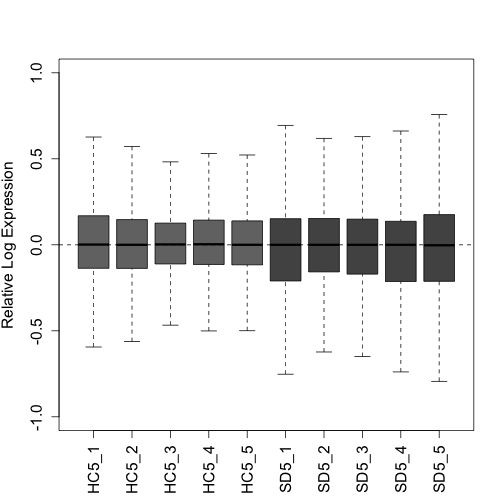

```r
plotPCA(uq, labels = FALSE, col = colLib, cex = 1.5, cex.axis = 1.3,
    cex.lab = 1.3, xlim = c(-0.75, 0.75), ylim = c(-0.75, 0.75),
    pch = rep(c(19, 17), times = c(5, 5)))
```

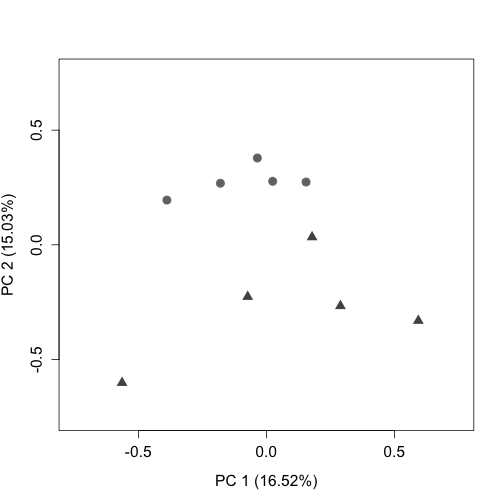

Load *RUVSeq* package:


```r
suppressPackageStartupMessages(library(RUVSeq))  # Version 1.32.0
```

*RUVseq*: Here we will estimate a matrix that contains estimated factors of unwanted factors after UQ normalization.

*RUVs* uses technical replicates or negative controls samples. In this instance, as we do not have negative controls for transcripts, we will use the rownames of the matrix y after filtering (all expressed transcripts). For additional information regarding *RUVs*, see [@risso2014].

We have set the numbers of factors of unwanted variation (*k*) = 4, which optimizes the positive control recovery (at the gene level) without removing signal. When one is beginning analysis, it is recommended to test a variety of *k*s, and compare the results to one another.


```r
s <- RUVs(x = uq, cIdx = rownames(y), scIdx = groups, k = 4)
```

Plot the RLE and PCA plots (quality control figures) again following *RUVs* normalization. After proper normalization, the largest source of variation in the dataset is the treatment as visualized on the PCA plot (separated along PC1).


```r
plotRLE(s$normalizedCounts, col = colLib, outline = FALSE, las = 3,
    ylim = c(-1, 1), ylab = "Relative Log Expression", cex.axis = 1.2,
    cex.lab = 1.2)
```

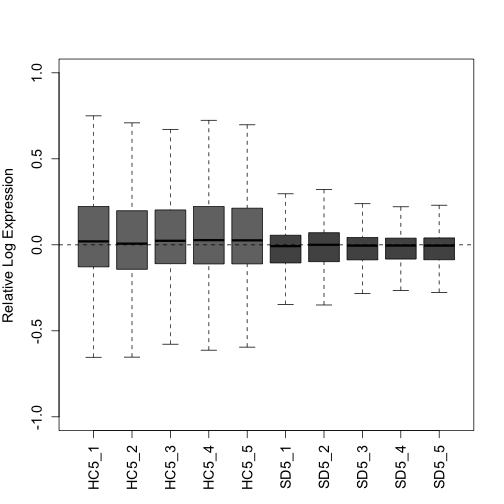

```r
plotPCA(s$normalizedCounts, labels = FALSE, col = colLib, cex = 1.3,
    cex.axis = 1.2, cex.lab = 1.2, xlim = c(-0.75, 0.75), ylim = c(-0.75,
        0.75), pch = rep(c(19, 17), times = c(5, 5)))
```

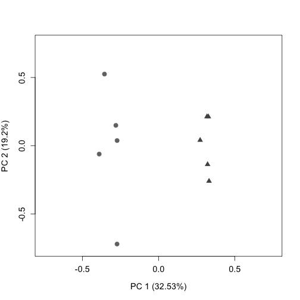

Downstream we will use *s\$W* (from *RUVs*) as the estimation of batch factors.

'infRepIdx' lists the inferential replicates (30):


```r
infRepIdx <- grep("infRep", assayNames(y), value = TRUE)
```

Save the number of inferential replicates as 'nreps':


```r
nreps <- length(infRepIdx)
nreps
```

```
## [1] 30
```

Account for continuous variables with *removeBatchEffect* from *limma*. Our samples do not fall into discrete clusters so we will use the following approach recommended by the *fishpond* developers.

In short, this is done by directly scaling the estimated counts across inferential replicates.

First inferential replicates are logged as *limma* requires log-expression values for a series of samples. This is done with the assay function from the *SummarizedExperiment* package.

First, we load the *limma* package:


```r
suppressPackageStartupMessages(library(limma))  # Version 3.54.2
```


```r
model_matrix <- model.matrix(~condition, colData(y))
pc <- 0.1  # This is added to avoid negative InfReps
for (k in seq_len(nreps)) {
    logInfRep <- log(assay(y, infRepIdx[k]) + pc)
    logInfRep <- limma::removeBatchEffect(logInfRep, covariates = s$W,
        design = model_matrix)
    assay(y, infRepIdx[k]) <- exp(logInfRep)
}
```

## Run Swish and Plot Additional Figures

The Swish method is described in [@zhu2019]. Note that the *set.seed* function allows for the reproducibility of exact results in the future.


```r
set.seed(1)
y <- swish(y, x = "condition")
```

```
## Progress:   1 on 100  Progress:   2 on 100  Progress:   3 on 100  Progress:   4 on 100  Progress:   5 on 100  Progress:   6 on 100  Progress:   7 on 100  Progress:   8 on 100  Progress:   9 on 100  Progress:  10 on 100  Progress:  11 on 100  Progress:  12 on 100  Progress:  13 on 100  Progress:  14 on 100  Progress:  15 on 100  Progress:  16 on 100  Progress:  17 on 100  Progress:  18 on 100  Progress:  19 on 100  Progress:  20 on 100  Progress:  21 on 100  Progress:  22 on 100  Progress:  23 on 100  Progress:  24 on 100  Progress:  25 on 100  Progress:  26 on 100  Progress:  27 on 100  Progress:  28 on 100  Progress:  29 on 100  Progress:  30 on 100  Progress:  31 on 100  Progress:  32 on 100  Progress:  33 on 100  Progress:  34 on 100  Progress:  35 on 100  Progress:  36 on 100  Progress:  37 on 100  Progress:  38 on 100  Progress:  39 on 100  Progress:  40 on 100  Progress:  41 on 100  Progress:  42 on 100  Progress:  43 on 100  Progress:  44 on 100  Progress:  45 on 100  Progress:  46 on 100  Progress:  47 on 100  Progress:  48 on 100  Progress:  49 on 100  Progress:  50 on 100  Progress:  51 on 100  Progress:  52 on 100  Progress:  53 on 100  Progress:  54 on 100  Progress:  55 on 100  Progress:  56 on 100  Progress:  57 on 100  Progress:  58 on 100  Progress:  59 on 100  Progress:  60 on 100  Progress:  61 on 100  Progress:  62 on 100  Progress:  63 on 100  Progress:  64 on 100  Progress:  65 on 100  Progress:  66 on 100  Progress:  67 on 100  Progress:  68 on 100  Progress:  69 on 100  Progress:  70 on 100  Progress:  71 on 100  Progress:  72 on 100  Progress:  73 on 100  Progress:  74 on 100  Progress:  75 on 100  Progress:  76 on 100  Progress:  77 on 100  Progress:  78 on 100  Progress:  79 on 100  Progress:  80 on 100  Progress:  81 on 100  Progress:  82 on 100  Progress:  83 on 100  Progress:  84 on 100  Progress:  85 on 100  Progress:  86 on 100  Progress:  87 on 100  Progress:  88 on 100  Progress:  89 on 100  Progress:  90 on 100  Progress:  91 on 100  Progress:  92 on 100  Progress:  93 on 100  Progress:  94 on 100  Progress:  95 on 100  Progress:  96 on 100  Progress:  97 on 100  Progress:  98 on 100  Progress:  99 on 100  Progress: 100 on 100
```

View a table of differently expressed transcripts with a qvalue \< 0.05:


```r
table(mcols(y)$qvalue < 0.05)
```

```
## 
## FALSE  TRUE 
## 38505 15525
```

You can also view a table that shows which transcripts are up regulated (1) in response to sleep deprivation and which are downregulated (-1):


```r
with(mcols(y), table(sig = qvalue < 0.05, sign.lfc = sign(log2FC)))
```

```
##        sign.lfc
## sig        -1     0     1
##   FALSE 25479    11 13015
##   TRUE   9709     0  5816
```

Here, we will export a text file (containing the median of each transcript across inferential replicates) for additional plotting. First, select all features, use abind to combine multi-dimensional arrays, and then take the median:


```r
infReps <- assays(y)[grep("infRep", assayNames(y))]
infArray <- abind::abind(as.list(infReps), along = 3)
dim(infArray)
```

```
## [1] 54030    10    30
```

```r
infMed <- apply(infArray, 1:2, median)
data.class(infMed)
```

```
## [1] "matrix"
```

```r
write.table(infMed, file = "DTE_InfMed.txt", sep = "\t")
```

Plot a histogram to show the distribution of pvalues:


```r
hist(mcols(y)$pvalue, col = "grey", ylim = c(0, 25000), main = "",
    xlab = "Pvalue", cex.axis = 0.9)
```

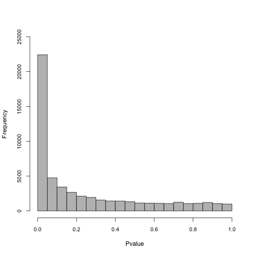

Add symbols (Gene IDs) to the *SummarizedExperiment* object. We will label genes on the MA plot in later steps. First load the *org.Mm.eg.db* package:


```r
suppressPackageStartupMessages(library(org.Mm.eg.db))  #Version 3.16.0
y <- addIds(y, "SYMBOL", gene = TRUE)
rowData(y)
```

```
## DataFrame with 54030 rows and 11 columns
##                        tx_id              gene_id
##                    <integer>      <CharacterList>
## ENSMUST00000162897      4224 ENSMUSG00000051951.5
## ENSMUST00000159265      4225 ENSMUSG00000051951.5
## ENSMUST00000070533      4226 ENSMUSG00000051951.5
## ENSMUST00000192692      4232 ENSMUSG00000102331.1
## ENSMUST00000193244         6 ENSMUSG00000102348.1
## ...                      ...                  ...
## ENSMUST00000084013    142588 ENSMUSG00000065947.3
## ENSMUST00000082414    142589 ENSMUSG00000064363.1
## ENSMUST00000082418    142593 ENSMUSG00000064367.1
## ENSMUST00000082419    142602 ENSMUSG00000064368.1
## ENSMUST00000082421    142594 ENSMUSG00000064370.1
##                                 tx_name log10mean      keep
##                             <character> <numeric> <logical>
## ENSMUST00000162897 ENSMUST00000162897.1   2.04050      TRUE
## ENSMUST00000159265 ENSMUST00000159265.1   1.70889      TRUE
## ENSMUST00000070533 ENSMUST00000070533.4   1.82758      TRUE
## ENSMUST00000192692 ENSMUST00000192692.1   1.72937      TRUE
## ENSMUST00000193244 ENSMUST00000193244.1   1.16536      TRUE
## ...                                 ...       ...       ...
## ENSMUST00000084013 ENSMUST00000084013.1   4.01172      TRUE
## ENSMUST00000082414 ENSMUST00000082414.1   5.48958      TRUE
## ENSMUST00000082418 ENSMUST00000082418.1   5.36163      TRUE
## ENSMUST00000082419 ENSMUST00000082419.1   3.24554      TRUE
## ENSMUST00000082421 ENSMUST00000082421.1   5.58889      TRUE
##                         stat     log2FC    pvalue    locfdr
##                    <numeric>  <numeric> <numeric> <numeric>
## ENSMUST00000162897  -7.73333  -0.268533 0.0420622  0.375400
## ENSMUST00000159265   3.66667   0.106852 0.3208627  1.000000
## ENSMUST00000070533  -4.96667  -0.218354 0.1850087  1.000000
## ENSMUST00000192692  -6.00000  -0.226598 0.1135445  0.763961
## ENSMUST00000193244   6.66667   0.219371 0.0800030  0.599861
## ...                      ...        ...       ...       ...
## ENSMUST00000084013   1.96667  0.0564183  0.597025         1
## ENSMUST00000082414   0.50000  0.0194699  0.892375         1
## ENSMUST00000082418  -3.50000 -0.0413981  0.343077         1
## ENSMUST00000082419  -4.30000 -0.1096372  0.246971         1
## ENSMUST00000082421  -2.53333 -0.0165749  0.493297         1
##                       qvalue      SYMBOL
##                    <numeric> <character>
## ENSMUST00000162897  0.106326        Xkr4
## ENSMUST00000159265  0.456228        Xkr4
## ENSMUST00000070533  0.306843        Xkr4
## ENSMUST00000192692  0.217177          NA
## ENSMUST00000193244  0.169147          NA
## ...                      ...         ...
## ENSMUST00000084013  0.712552        ND4L
## ENSMUST00000082414  0.930020         ND4
## ENSMUST00000082418  0.478829         ND5
## ENSMUST00000082419  0.377180         ND6
## ENSMUST00000082421  0.621844        CYTB
```

Turn 'y' into a dataframe here, and save as a different variable. We do this to intersect with other lists when making plots, such as genes to highlight on the MA plot downstream. Check the *dim* to ensure that the size of the data frame has not changed:


```r
y_rowData <- as.data.frame(rowData(y))
dim(y_rowData)
```

```
## [1] 54030    11
```

Here we graph an MA plot. An MA plot shows log2FC vs the log10mean. Transcripts above M=0 are upregulated, while transcripts below are downregulated.

The transcripts that are farthest away from the y intercept (have the largest log10mean values) are the ones most affected by the treatment.

Set colors for the MA plot here: Transcripts that do not have a significant change in expression are light grey. Transcripts that are significantly affected (qvalue \< 0.05) by SD are dark grey.


```r
Significant_Color <- brewer.pal(9, "Greys")[8]
```

A subset of transcripts that we have chosen to highlight that also have significant changes in expression (qvalue \< 0.05) will be bright blue. Downstream, we will apply an abs(log2FC) threshold of 0.2 to these transcripts.


```r
Highlight_Color <- "dodgerblue"
```

Read the list of genes that we have chosen to highlight here.


```r
load(file = "Highlight_Genes.rda")
Highlight_Genes
```

```
## # A tibble: 11 × 1
##    ...1    
##    <chr>   
##  1 Arc     
##  2 Bdnf    
##  3 Cirbp   
##  4 Eif4ebp1
##  5 Fos     
##  6 Homer1  
##  7 Mef2c   
##  8 Hdac7   
##  9 Hspa5   
## 10 Sst     
## 11 Wnt9a
```

Save 'Highlight_Genes' as a matrix titled 'Gene_Names':


```r
Gene_Names <- as.matrix(Highlight_Genes)
dim(Gene_Names)
```

```
## [1] 11  1
```

Remove commas, quotes and trailing spaces:


```r
Gene_Names <- unlist(strsplit(Gene_Names, ","))
Gene_Names <- noquote(Gene_Names)
Gene_Names <- trimws(Gene_Names)
```

We will intersect 'y_rowData' (the dataframe saved above) with the 'Gene_Names' matrix just saved using the *filter* function of *dplyr*:


```r
Data_Intersection <- dplyr::filter(y_rowData, SYMBOL %in% Gene_Names &
    qvalue < 0.05 & abs(log2FC) > 0.2)
dim(Data_Intersection)
```

```
## [1] 33 11
```

Use *plotMASwish* to generate the MA plot. Include labels and points for the genes in 'Gene_Names' using the code below (Only transcripts that fit the qvalue and log2FC threshold will be labeled):


```r
plotMASwish(y, alpha = 0.05, xlim = c(0, 6), ylim = c(-8, 5),
    sigcolor = Significant_Color, cex.axis = 1.3, cex.lab = 1.3)

with(subset(mcols(y), SYMBOL %in% Gene_Names & qvalue < 0.05 &
    abs(log2FC) > 0.2), text(log10mean, log2FC, SYMBOL, col = Highlight_Color,
    pos = 4, cex = 0.8, font = 2))

points(Data_Intersection$log10mean, Data_Intersection$log2FC,
    pch = 0, col = Highlight_Color, cex = 1, lwd = 1)

points(Data_Intersection$log10mean, Data_Intersection$log2FC,
    pch = 20, col = Highlight_Color, cex = 0.2, lwd = 2)
```

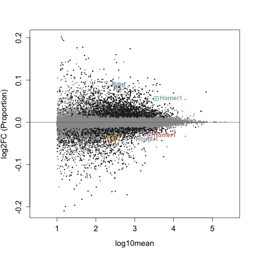

Write text file using the code below. Select columns to include in the text file. These lists will then be annotated in Perl with the gene name and description.


```r
cols <- c("log10mean", "log2FC", "pvalue", "qvalue", "SYMBOL")
y_filter <- mcols(y)
y_filter <- as.data.frame(y_filter)[, cols]
y_filter <- dplyr::filter(y_filter, qvalue < 0.05)
dim(y_filter)
```

```
## [1] 15525     5
```

```r
write.table(y_filter, file = "DTE_Significant_k=4.txt")
```

# Differential Gene Expression Starts Here

Use the *summarizeToGene* function to proceed with analysis at the gene level. For the remainder of the analysis, 'gse' will be referred to as 'gy':


```r
gse <- summarizeToGene(se)
gy <- gse
```

I will do the same two group comparison between wild-type animals that was done at the transcript level. To quickly summarize this again, we will compare animals that were left undisturbed in their home cage (HC) for 5 hours and those who were sleep sleep deprived (SD) via gentle handling for 5 hours.

As above, the following analysis will compare the second group to the first group listed in *levels*, in this case, SD compared to HC controls.


```r
gy <- gy[, gy$condition %in% c("WTHC5", "WTSD5")]
gy$condition <- factor(gy$condition, levels = c("WTHC5", "WTSD5"))
```

## Proceed with Differential Expression Analysis

Scale inferential replicates to the mean sequencing depth. It is important to note that only the inferential replicates are scaled during this process, not the counts.


```r
gy <- scaleInfReps(gy)
```

```
## Progress:  1 on 30  Progress:  2 on 30  Progress:  3 on 30  Progress:  4 on 30  Progress:  5 on 30  Progress:  6 on 30  Progress:  7 on 30  Progress:  8 on 30  Progress:  9 on 30  Progress: 10 on 30  Progress: 11 on 30  Progress: 12 on 30  Progress: 13 on 30  Progress: 14 on 30  Progress: 15 on 30  Progress: 16 on 30  Progress: 17 on 30  Progress: 18 on 30  Progress: 19 on 30  Progress: 20 on 30  Progress: 21 on 30  Progress: 22 on 30  Progress: 23 on 30  Progress: 24 on 30  Progress: 25 on 30  Progress: 26 on 30  Progress: 27 on 30  Progress: 28 on 30  Progress: 29 on 30  Progress: 30 on 30
```

Before filtering, we have 54,347 genes:


```r
dim(gy)
```

```
## [1] 54347    10
```

Filter here, keeping a minimum count of 10 transcripts across a minimum of 3 replicates. In this step, we are removing most of the rows with zero to very low counts before proceeding with the analysis.


```r
gy <- labelKeep(gy, minCount = 10, minN = 3)
```

After filtering, we have 18,334 genes:


```r
gy <- gy[mcols(gy)$keep, ]
dim(gy)
```

```
## [1] 18334    10
```

## Determining the Sources of Unwanted Variation with RUVs

During transcript expression analysis we already assembled a matrix that contains the groups. View it here to make sure 'groups' appears as expected.


```r
groups
```

```
##      [,1] [,2] [,3] [,4] [,5]
## [1,]    1    2    3    4    5
## [2,]    6    7    8    9   10
```

We will use the same colors that were used for differential transcript expression, so this step does not need to be repeated. Again, HC controls will be light grey and SD samples will be dark grey.

Remove the version #s for each gene. It is helpful to note that the version #s correspond to the release version:


```r
rownames(gy) <- lapply(rownames(gy), sub, pattern = "\\.\\d+$",
    replacement = "")
data.class(rownames(gy))
```

```
## [1] "character"
```

Extract the counts from the *SummarizedExperiment* object for normalization. Note that we will estimate the factors of unwanted variation on the counts, and then we will apply that across the inferential replicates further downstream:


```r
counts_gy <- as.matrix((assays(gy)[["counts"]]))
data.class(counts_gy)
```

```
## [1] "matrix"
```

For gene level analysis, we can use a set of positive controls from [@gerstner2016] to assess the performance of our pipeline downstream. Load the positive controls here:


```r
load(file = "Gene_Positive_Controls.rda")
```

In preparation for determining our positive control recovery, we will then want to intersect the expressed genes with the positive controls.


```r
Intersect_Positive_Expressed <- intersect(Gene_Positive_Controls[,
    1], row.names(counts_gy))
length(Intersect_Positive_Expressed)
```

```
## [1] 671
```

Upper Quartile (UQ) normalization is implemented here with the *EDASeq* package (same as with transcript expression analysis), and accounts for variation in sequencing depth:

As the counts were not scaled (only the inferential replicates), we need to account for sequencing depth prior to proceeding with *RUVs* normalization, which allows us to obtain a the estimated factors of unwanted variation (*gs\$W*):


```r
g_uq <- betweenLaneNormalization(counts_gy, which = "upper")
dim(g_uq)
```

```
## [1] 18334    10
```

Shorten the sample names (*colnames*) for figures:


```r
colnames(g_uq)
```

```
##  [1] "WTHC5_PFC_1_quant" "WTHC5_PFC_2_quant" "WTHC5_PFC_3_quant"
##  [4] "WTHC5_PFC_4_quant" "WTHC5_PFC_5_quant" "WTSD5_PFC_1_quant"
##  [7] "WTSD5_PFC_2_quant" "WTSD5_PFC_3_quant" "WTSD5_PFC_4_quant"
## [10] "WTSD5_PFC_5_quant"
```

```r
colnames(g_uq) <- c("HC5_1", "HC5_2", "HC5_3", "HC5_4", "HC5_5",
    "SD5_1", "SD5_2", "SD5_3", "SD5_4", "SD5_5")
```

Here we plot two quality control plots (RLE and PCA) following UQ normalization. Note that triangles are sleep deprived animals and circles are home cage control animals that were collected at the same circadian time:


```r
plotRLE(g_uq, col = colLib, outline = FALSE, las = 3, ylim = c(-1,
    1), ylab = "Relative Log Expression", cex.axis = 1.3, cex.lab = 1.3)
```

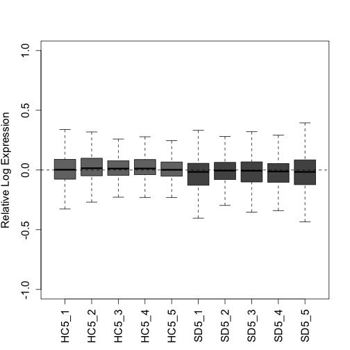

```r
plotPCA(g_uq, labels = FALSE, col = colLib, cex = 1.5, cex.axis = 1.3,
    cex.lab = 1.3, xlim = c(-0.75, 0.75), ylim = c(-0.75, 0.75),
    pch = rep(c(19, 17), times = c(5, 5)))
```

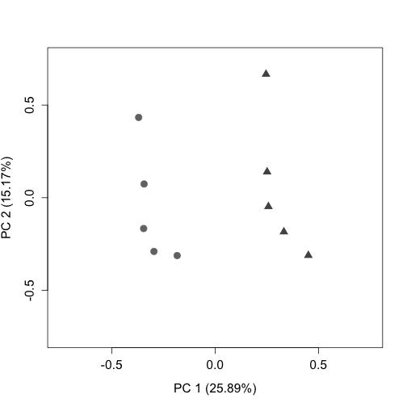

*RUVseq*: Here we will estimate a matrix that contains estimated factors of unwanted factors after UQ normalization.

*RUVs* uses technical replicates or negative controls samples. We do have negative control genes from [@gerstner2016] for differential gene analysis, and will load them here. For additional information regarding *RUVs*, see [@risso2014].


```r
load(file = "Gene_Negative_Controls.rda")
```

After loading negative controls, intersect with the counts, to only include the negative controls that are expressed in the dataset:


```r
Negative <- intersect(Gene_Negative_Controls[, 1], rownames(counts_gy))
length(Negative)
```

```
## [1] 3024
```

After viewing the results of the differential expression analysis with several *k*s, we have set the numbers of factors of unwanted variation (*k*) = 4, which optimizes the number of differentially expressed genes and transcripts detected, and the positive control recovery (at the gene level) without removing signal.


```r
gs <- RUVs(x = g_uq, cIdx = Negative, scIdx = groups, k = 4)
```

Plot the RLE and PCA plots (quality control figures) again following *RUVs* normalization.


```r
plotRLE(gs$normalizedCounts, col = colLib, outline = FALSE, las = 3,
    ylim = c(-1, 1), ylab = "Relative Log Expression", cex.axis = 1.2,
    cex.lab = 1.2)
```

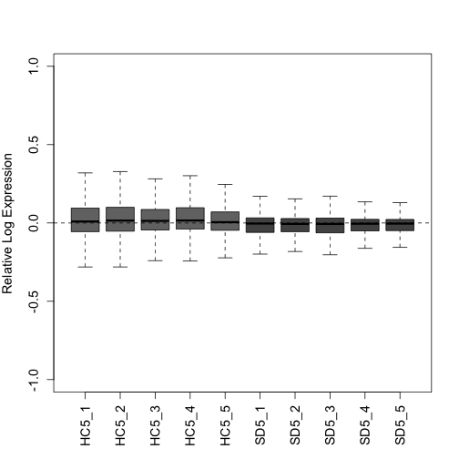

```r
plotPCA(gs$normalizedCounts, labels = FALSE, col = colLib, cex = 1.3,
    cex.axis = 1.2, cex.lab = 1.2, xlim = c(-0.75, 0.75), ylim = c(-0.75,
        0.75), pch = rep(c(19, 17), times = c(5, 5)))
```

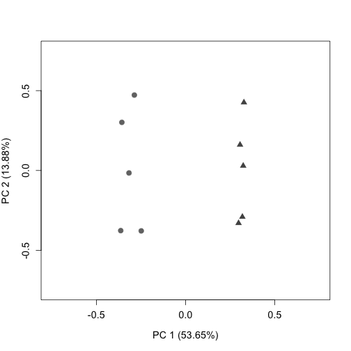

Downstream we will use *gs\$W* (from *RUVs*) as the estimation of batch factors.

'infRepIdx' lists the inferential replicates (30):


```r
infRepIdx <- grep("infRep", assayNames(gy), value = TRUE)
```

Save the number of inferential replicates as 'nreps_gy':


```r
nreps_gy <- length(infRepIdx)
nreps_gy
```

```
## [1] 30
```

Account for continuous variables with *removeBatchEffect* from *limma*. Our samples do not fall into discrete clusters so we will use the following approach recommended by the *fishpond* developers.

In short, this is done by directly scaling the estimated counts across inferential replicates.

First inferential replicates are logged as *limma* requires log-expression values for a series of samples. This is done with the *assay* function from the *SummarizedExperiment* package.

First, we load the *limma* package:


```r
model_matrix_gy <- model.matrix(~condition, colData(gy))
pc <- 0.1  # This is added to avoid negative InfReps
for (k in seq_len(nreps_gy)) {
    logInfRep <- log(assay(gy, infRepIdx[k]) + pc)
    logInfRep <- limma::removeBatchEffect(logInfRep, covariates = gs$W,
        design = model_matrix_gy)
    assay(gy, infRepIdx[k]) <- exp(logInfRep)
}
```

## Run Swish and Plot Additional Figures

The Swish method is described in [@zhu2019]. Note that the *set.seed* function allows for the reproducibility of exact results in the future.


```r
set.seed(1)
gy <- swish(gy, x = "condition")
```

```
## Progress:   1 on 100  Progress:   2 on 100  Progress:   3 on 100  Progress:   4 on 100  Progress:   5 on 100  Progress:   6 on 100  Progress:   7 on 100  Progress:   8 on 100  Progress:   9 on 100  Progress:  10 on 100  Progress:  11 on 100  Progress:  12 on 100  Progress:  13 on 100  Progress:  14 on 100  Progress:  15 on 100  Progress:  16 on 100  Progress:  17 on 100  Progress:  18 on 100  Progress:  19 on 100  Progress:  20 on 100  Progress:  21 on 100  Progress:  22 on 100  Progress:  23 on 100  Progress:  24 on 100  Progress:  25 on 100  Progress:  26 on 100  Progress:  27 on 100  Progress:  28 on 100  Progress:  29 on 100  Progress:  30 on 100  Progress:  31 on 100  Progress:  32 on 100  Progress:  33 on 100  Progress:  34 on 100  Progress:  35 on 100  Progress:  36 on 100  Progress:  37 on 100  Progress:  38 on 100  Progress:  39 on 100  Progress:  40 on 100  Progress:  41 on 100  Progress:  42 on 100  Progress:  43 on 100  Progress:  44 on 100  Progress:  45 on 100  Progress:  46 on 100  Progress:  47 on 100  Progress:  48 on 100  Progress:  49 on 100  Progress:  50 on 100  Progress:  51 on 100  Progress:  52 on 100  Progress:  53 on 100  Progress:  54 on 100  Progress:  55 on 100  Progress:  56 on 100  Progress:  57 on 100  Progress:  58 on 100  Progress:  59 on 100  Progress:  60 on 100  Progress:  61 on 100  Progress:  62 on 100  Progress:  63 on 100  Progress:  64 on 100  Progress:  65 on 100  Progress:  66 on 100  Progress:  67 on 100  Progress:  68 on 100  Progress:  69 on 100  Progress:  70 on 100  Progress:  71 on 100  Progress:  72 on 100  Progress:  73 on 100  Progress:  74 on 100  Progress:  75 on 100  Progress:  76 on 100  Progress:  77 on 100  Progress:  78 on 100  Progress:  79 on 100  Progress:  80 on 100  Progress:  81 on 100  Progress:  82 on 100  Progress:  83 on 100  Progress:  84 on 100  Progress:  85 on 100  Progress:  86 on 100  Progress:  87 on 100  Progress:  88 on 100  Progress:  89 on 100  Progress:  90 on 100  Progress:  91 on 100  Progress:  92 on 100  Progress:  93 on 100  Progress:  94 on 100  Progress:  95 on 100  Progress:  96 on 100  Progress:  97 on 100  Progress:  98 on 100  Progress:  99 on 100  Progress: 100 on 100
```

View a table of differently expressed genes with a qvalue \< 0.05:


```r
table(mcols(gy)$qvalue < 0.05)
```

```
## 
## FALSE  TRUE 
##  9829  8505
```

You can also view a table that shows which genes are up regulated (1) in response to sleep deprivation and which are downregulated (-1):


```r
with(mcols(gy), table(sig = qvalue < 0.05, sign.lfc = sign(log2FC)))
```

```
##        sign.lfc
## sig       -1    1
##   FALSE 5456 4373
##   TRUE  4364 4141
```

Here, we can assess our positive control recovery:


```r
significant_qvalue_gy <- (mcols(gy)[mcols(gy)$qvalue < 0.05,
    ])
dim(significant_qvalue_gy)
```

```
## [1] 8505    9
```

```r
Positive_Controls_Recovery <- length(intersect(row.names(significant_qvalue_gy),
    Intersect_Positive_Expressed))

(length(intersect(row.names(significant_qvalue_gy), Intersect_Positive_Expressed))/length(Intersect_Positive_Expressed)) *
    100
```

```
## [1] 83.15946
```

Plot a histogram to show the distribution of pvalues:


```r
hist(mcols(gy)$pvalue, col = "grey", ylim = c(0, 10000), main = "",
    xlab = "Pvalue", cex.axis = 0.9)
```

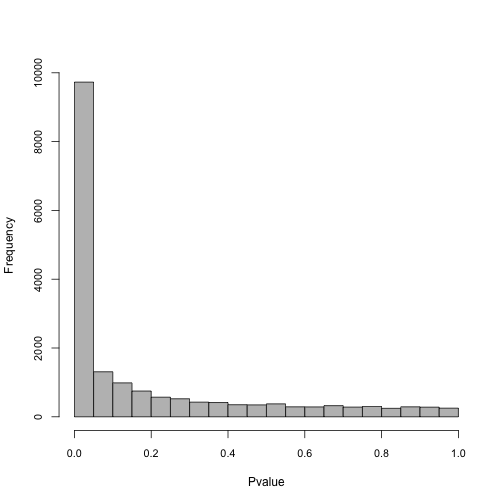

Add symbols (Gene IDs) to the *SummarizedExperiment* object, just like we did with transcript expression analysis.


```r
gy <- addIds(gy, "SYMBOL", gene = TRUE)
rowData(gy)
```

```
## DataFrame with 18334 rows and 10 columns
##                                  gene_id
##                              <character>
## ENSMUSG00000000001  ENSMUSG00000000001.4
## ENSMUSG00000000028 ENSMUSG00000000028.15
## ENSMUSG00000000037 ENSMUSG00000000037.17
## ENSMUSG00000000049 ENSMUSG00000000049.11
## ENSMUSG00000000056  ENSMUSG00000000056.7
## ...                                  ...
## ENSMUSG00000118608  ENSMUSG00000118608.1
## ENSMUSG00000118619  ENSMUSG00000118619.1
## ENSMUSG00000118623  ENSMUSG00000118623.1
## ENSMUSG00000118633  ENSMUSG00000118633.1
## ENSMUSG00000118651  ENSMUSG00000118651.1
##                                                                                 tx_ids
##                                                                        <CharacterList>
## ENSMUSG00000000001                                                ENSMUST00000000001.4
## ENSMUSG00000000028 ENSMUST00000000028.13,ENSMUST00000096990.9,ENSMUST00000115585.1,...
## ENSMUSG00000000037  ENSMUST00000238603.1,ENSMUST00000101113.8,ENSMUST00000087090.9,...
## ENSMUSG00000000049  ENSMUST00000133383.7,ENSMUST00000146050.1,ENSMUST00000152958.7,...
## ENSMUSG00000000056      ENSMUST00000103015.3,ENSMUST00000154047.1,ENSMUST00000151088.1
## ...                                                                                ...
## ENSMUSG00000118608                           ENSMUST00000232598.1,ENSMUST00000239181.1
## ENSMUSG00000118619                                                ENSMUST00000239256.1
## ENSMUSG00000118623                           ENSMUST00000124129.7,ENSMUST00000145993.8
## ENSMUSG00000118633      ENSMUST00000239354.1,ENSMUST00000239230.1,ENSMUST00000239308.1
## ENSMUSG00000118651                                                ENSMUST00000239444.1
##                    log10mean      keep      stat       log2FC
##                    <numeric> <logical> <numeric>    <numeric>
## ENSMUSG00000000001   3.06833      TRUE  12.26667    0.1757289
## ENSMUSG00000000028   1.79075      TRUE  -0.90000   -0.0213605
## ENSMUSG00000000037   1.63299      TRUE -12.03333   -0.8299316
## ENSMUSG00000000049   1.19460      TRUE   2.56667    0.0461280
## ENSMUSG00000000056   3.31778      TRUE  12.50000    0.2429778
## ...                      ...       ...       ...          ...
## ENSMUSG00000118608  2.043497      TRUE  -5.36667 -2.46083e-01
## ENSMUSG00000118619  1.177520      TRUE  -5.50000 -1.62821e-01
## ENSMUSG00000118623  1.301789      TRUE  -4.93333 -6.98220e-01
## ENSMUSG00000118633  0.923585      TRUE  -2.40000 -3.61364e-05
## ENSMUSG00000118651  1.396473      TRUE -10.50000 -5.64111e-01
##                         pvalue      locfdr      qvalue
##                      <numeric>   <numeric>   <numeric>
## ENSMUSG00000000001 2.36337e-03 2.73538e-02 0.010738538
## ENSMUSG00000000028 8.29876e-01 1.00000e+00 0.874171215
## ENSMUSG00000000037 2.91153e-03 3.10390e-02 0.011396243
## ENSMUSG00000000049 5.37582e-01 1.00000e+00 0.627612073
## ENSMUSG00000000056 5.45435e-07 1.45352e-05 0.000003663
## ...                        ...         ...         ...
## ENSMUSG00000118608  0.20218501   1.0000000   0.2894401
## ENSMUSG00000118619  0.19165703   1.0000000   0.2768547
## ENSMUSG00000118623  0.23875805   1.0000000   0.3305437
## ENSMUSG00000118633  0.56579633   1.0000000   0.6534780
## ENSMUSG00000118651  0.00899858   0.0905034   0.0232366
##                         SYMBOL
##                    <character>
## ENSMUSG00000000001       Gnai3
## ENSMUSG00000000028       Cdc45
## ENSMUSG00000000037       Scml2
## ENSMUSG00000000049        Apoh
## ENSMUSG00000000056        Narf
## ...                        ...
## ENSMUSG00000118608      Gm4988
## ENSMUSG00000118619          NA
## ENSMUSG00000118623          NA
## ENSMUSG00000118633   Ccl19-ps2
## ENSMUSG00000118651     Gm17315
```

Turn 'gy' into a dataframe here, and save as a different variable. We do this to intersect with other lists when making plots, such as genes to highlight on the MA plot downstream. Check the *dim* to ensure that it has not changed:


```r
gy_rowData <- as.data.frame(rowData(gy))
dim(gy_rowData)
```

```
## [1] 18334    10
```

Here we graph an MA plot. An MA plot shows log2FC vs the log10mean. Genes above M=0 are upregulated, while genes below are downregulated.

The genes that are farthest away from the y intercept (have the largest log10mean values) are the ones most affected by the treatment.

We previously set colors for the MA plot, so we will only set one additional color here: the positive controls.

A quick summary of the other colors: Genes that do not have a significant change in expression are light grey. Genes that are significantly affected (qvalue \< 0.05) by SD are dark grey. Genes that we have chosen to highlight that are also significant are bright blue.


```r
Positive_Color <- brewer.pal(9, "Set1")[1]
```

We will intersect 'gy_rowData' (the dataframe saved above) with the 'Gene_Names' matrix from transcript expression analysis:


```r
Data_Intersection <- dplyr::filter(gy_rowData, SYMBOL %in% Gene_Names &
    qvalue < 0.05 & abs(log2FC) > 0.2)
dim(Data_Intersection)
```

```
## [1] 10 10
```

Use *plotMASwish* to generate the MA plot. Include labels and points for the genes in 'Gene_Names' and points for positive controls using the code below (Only genes that fit the qvalue and log2FC threshold will be labeled):


```r
plotMASwish(gy, alpha = 0.05, xlim = c(0.5, 5.5), ylim = c(-7,
    5), sigcolor = Significant_Color, cex.axis = 1.3, cex.lab = 1.3)

with(subset(mcols(gy), SYMBOL %in% Gene_Names & qvalue < 0.05 &
    abs(log2FC) > 0.2), text(log10mean, log2FC, SYMBOL, col = Highlight_Color,
    pos = 4, cex = 0.8, font = 2))

Positive_Controls_Signifcant <- intersect(row.names(significant_qvalue_gy),
    Intersect_Positive_Expressed)
Positive_Controls_Plot <- mcols(gy)[rownames(mcols(gy)) %in%
    Positive_Controls_Signifcant, ]
dim(Positive_Controls_Plot)
```

```
## [1] 558  10
```

```r
points(x = Positive_Controls_Plot$log10mean, y = Positive_Controls_Plot$log2FC,
    pch = 20, col = Positive_Color, cex = 0.2, lwd = 2)

points(Data_Intersection$log10mean, Data_Intersection$log2FC,
    pch = 0, col = Highlight_Color, cex = 1, lwd = 1)

points(Data_Intersection$log10mean, Data_Intersection$log2FC,
    pch = 20, col = Highlight_Color, cex = 0.2, lwd = 2)
```

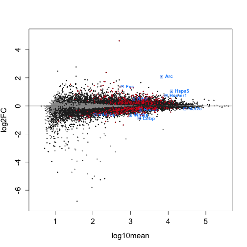

Write text file using the code below. Select columns to include in the text file. These lists will then be annotated in Perl with the gene name and description.


```r
cols <- c("log10mean", "log2FC", "pvalue", "qvalue")
gy_filter <- mcols(gy)
gy_filter <- as.data.frame(gy_filter)[, cols]
gy_filter <- dplyr::filter(gy_filter, qvalue < 0.05)
dim(gy_filter)
```

```
## [1] 8505    4
```

```r
write.table(gy_filter, file = "DGE_Significant_k=4.txt")
```

## Session Info


```r
sessionInfo()
```

```
## R version 4.2.2 (2022-10-31)
## Platform: x86_64-apple-darwin17.0 (64-bit)
## Running under: macOS Ventura 13.2
## 
## Matrix products: default
## LAPACK: /Library/Frameworks/R.framework/Versions/4.2/Resources/lib/libRlapack.dylib
## 
## locale:
## [1] en_US.UTF-8/en_US.UTF-8/en_US.UTF-8/C/en_US.UTF-8/en_US.UTF-8
## 
## attached base packages:
## [1] stats4    stats     graphics  grDevices utils     datasets 
## [7] methods   base     
## 
## other attached packages:
##  [1] GenomicFeatures_1.50.4      org.Mm.eg.db_3.16.0        
##  [3] AnnotationDbi_1.60.2        RUVSeq_1.32.0              
##  [5] edgeR_3.40.2                limma_3.54.2               
##  [7] EDASeq_2.32.0               ShortRead_1.56.1           
##  [9] GenomicAlignments_1.34.1    Rsamtools_2.14.0           
## [11] Biostrings_2.66.0           XVector_0.38.0             
## [13] BiocParallel_1.32.6         RColorBrewer_1.1-3         
## [15] fishpond_2.4.1              tximeta_1.16.1             
## [17] SummarizedExperiment_1.28.0 Biobase_2.58.0             
## [19] GenomicRanges_1.50.2        GenomeInfoDb_1.34.9        
## [21] IRanges_2.32.0              S4Vectors_0.36.2           
## [23] BiocGenerics_0.44.0         MatrixGenerics_1.10.0      
## [25] matrixStats_0.63.0          knitr_1.42                 
## [27] BiocStyle_2.26.0           
## 
## loaded via a namespace (and not attached):
##   [1] readxl_1.4.2                  AnnotationHub_3.6.0          
##   [3] aroma.light_3.28.0            BiocFileCache_2.6.1          
##   [5] shades_1.4.0                  plyr_1.8.8                   
##   [7] lazyeval_0.2.2                splines_4.2.2                
##   [9] ggplot2_3.4.2                 digest_0.6.31                
##  [11] ensembldb_2.22.0              htmltools_0.5.5              
##  [13] fansi_1.0.4                   magrittr_2.0.3               
##  [15] memoise_2.0.1                 svMisc_1.2.3                 
##  [17] R.utils_2.12.2                prettyunits_1.1.1            
##  [19] jpeg_0.1-10                   colorspace_2.1-0             
##  [21] blob_1.2.4                    rappdirs_0.3.3               
##  [23] xfun_0.38                     dplyr_1.1.1                  
##  [25] crayon_1.5.2                  RCurl_1.98-1.12              
##  [27] jsonlite_1.8.4                tximport_1.26.1              
##  [29] glue_1.6.2                    gtable_0.3.3                 
##  [31] zlibbioc_1.44.0               DelayedArray_0.24.0          
##  [33] SingleCellExperiment_1.20.1   abind_1.4-5                  
##  [35] scales_1.2.1                  DBI_1.1.3                    
##  [37] Rcpp_1.0.10                   xtable_1.8-4                 
##  [39] progress_1.2.2                bit_4.0.5                    
##  [41] httr_1.4.5                    ellipsis_0.3.2               
##  [43] pkgconfig_2.0.3               XML_3.99-0.14                
##  [45] R.methodsS3_1.8.2             dbplyr_2.3.2                 
##  [47] deldir_1.0-6                  locfit_1.5-9.7               
##  [49] utf8_1.2.3                    tidyselect_1.2.0             
##  [51] rlang_1.1.0                   reshape2_1.4.4               
##  [53] later_1.3.0                   munsell_0.5.0                
##  [55] BiocVersion_3.16.0            cellranger_1.1.0             
##  [57] tools_4.2.2                   cachem_1.0.7                 
##  [59] cli_3.6.1                     generics_0.1.3               
##  [61] RSQLite_2.3.1                 evaluate_0.20                
##  [63] stringr_1.5.0                 fastmap_1.1.1                
##  [65] yaml_2.3.7                    bit64_4.0.5                  
##  [67] purrr_1.0.1                   KEGGREST_1.38.0              
##  [69] AnnotationFilter_1.22.0       mime_0.12                    
##  [71] formatR_1.14                  R.oo_1.25.0                  
##  [73] xml2_1.3.3                    biomaRt_2.54.1               
##  [75] compiler_4.2.2                rstudioapi_0.15.0            
##  [77] filelock_1.0.2                curl_5.0.0                   
##  [79] png_0.1-8                     interactiveDisplayBase_1.36.0
##  [81] tibble_3.2.1                  stringi_1.7.12               
##  [83] highr_0.10                    lattice_0.21-8               
##  [85] ProtGenerics_1.30.0           Matrix_1.5-4                 
##  [87] vctrs_0.6.1                   pillar_1.9.0                 
##  [89] lifecycle_1.0.3               BiocManager_1.30.20          
##  [91] bitops_1.0-7                  httpuv_1.6.9                 
##  [93] patchwork_1.1.2               rtracklayer_1.58.0           
##  [95] qvalue_2.30.0                 R6_2.5.1                     
##  [97] BiocIO_1.8.0                  latticeExtra_0.6-30          
##  [99] hwriter_1.3.2.1               promises_1.2.0.1             
## [101] codetools_0.2-19              MASS_7.3-58.3                
## [103] gtools_3.9.4                  rjson_0.2.21                 
## [105] withr_2.5.0                   GenomeInfoDbData_1.2.9       
## [107] parallel_4.2.2                hms_1.1.3                    
## [109] grid_4.2.2                    rmarkdown_2.21               
## [111] shiny_1.7.4                   interp_1.1-4                 
## [113] restfulr_0.0.15
```

