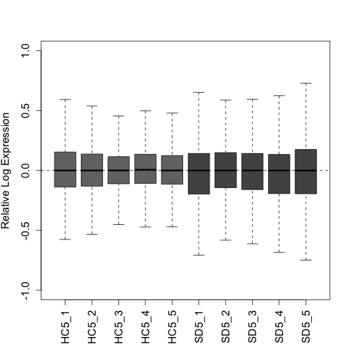
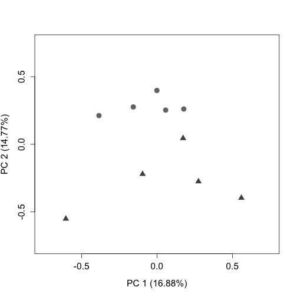
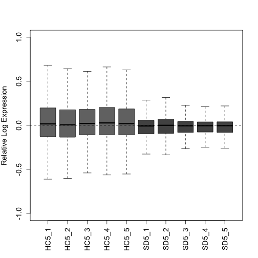
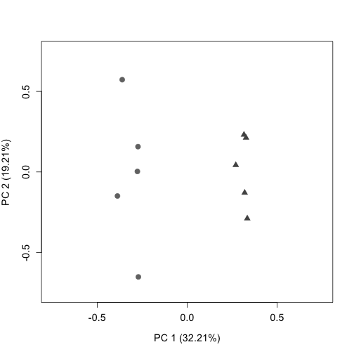
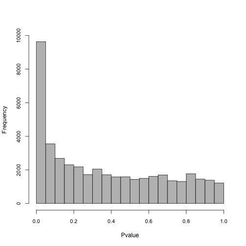

# Differential Transcript Usage using Fishpond with RUVs

## Description

Sleep deprivation (SD) has negative effects on brain function. Sleep problems are prevalent in neurodevelopmental, neurodegenerative and psychiatric disorders. Thus, understanding the molecular consequences of SD is of fundamental importance in neuroscience. In this study, we present the first simultaneous bulk and single-nuclear (sn)RNA sequencing characterization of the effects of SD in the mouse frontal cortex. We show that SD predominantly affects glutamatergic neurons, specifically in layers 4 and 5, and produces isoform switching of thousands of transcripts. At both the global and cell-type specific level, SD has a large repressive effect on transcription, down-regulating thousands of genes and transcripts; underscoring the importance of accounting for the effects of sleep loss in transcriptome studies of brain function. As a resource we provide extensive characterizations of cell types, genes, transcripts and pathways affected by SD; as well as tutorials for data analysis.

This code was adapted from the tutorial here: <https://bioconductor.org/packages/release/bioc/vignettes/fishpond/inst/doc/swish.html#Quick_start>

## Data Availability

"Raw" sequencing data for this analysis is stored in GEO under accession number [GSE211088](https://www.ncbi.nlm.nih.gov/geo/query/acc.cgi?acc=GSE211088). Additionally, the bulk files were previously published [@ingiosi2019] and can be accessed in GEO under accession number [GSE113754](https://www.ncbi.nlm.nih.gov/geo/query/acc.cgi?acc=GSE113754).

The code used in this analysis has been deposited into Github, and can be accessed via the following link: **link to github folder where this code is**

Prior to this analysis, files were quantified using *Salmon* [@patro2017] and imported into *tximeta* [@love2020] to generate a *SummarizedExperiment* object.

## Data Import

Establish the working directory using the code below. The working directory can be thought of as the default location where files can be accessed from or saved to.


```r
setwd("~/Dropbox/Sleep_RNAseq_Splicing/BulkRNAseq_SD/Final_Tximeta")
dir <- setwd("~/Dropbox/Sleep_RNAseq_Splicing/BulkRNAseq_SD/Final_Tximeta")
```

Import the colData, which contains the sample names and condition (the condition is necessary for Fishpond). In short, the colData is a file that contains descriptions of the samples, and is created during tximeta [@love2020]. You can see what the columns and first few rows of the file look like using the *head()* function:


```r
load(file = "coldata.rda")
head(coldata)
```

```
##                               names condition
## S3HC5_PFC_1_quant S3HC5_PFC_1_quant     S3HC5
## S3HC5_PFC_2_quant S3HC5_PFC_2_quant     S3HC5
## S3HC5_PFC_3_quant S3HC5_PFC_3_quant     S3HC5
## S3HC5_PFC_4_quant S3HC5_PFC_4_quant     S3HC5
## S3HC5_PFC_5_quant S3HC5_PFC_5_quant     S3HC5
## S3HC7_PFC_1_quant S3HC7_PFC_1_quant     S3HC7
##                                                                                                                                        files
## S3HC5_PFC_1_quant /Users/kaitlynford/Dropbox/Sleep_RNAseq_Splicing/BulkRNAseq_SD/Final_Tximeta/data/Salmon_Quants/S3HC5_PFC_1_quant/quant.sf
## S3HC5_PFC_2_quant /Users/kaitlynford/Dropbox/Sleep_RNAseq_Splicing/BulkRNAseq_SD/Final_Tximeta/data/Salmon_Quants/S3HC5_PFC_2_quant/quant.sf
## S3HC5_PFC_3_quant /Users/kaitlynford/Dropbox/Sleep_RNAseq_Splicing/BulkRNAseq_SD/Final_Tximeta/data/Salmon_Quants/S3HC5_PFC_3_quant/quant.sf
## S3HC5_PFC_4_quant /Users/kaitlynford/Dropbox/Sleep_RNAseq_Splicing/BulkRNAseq_SD/Final_Tximeta/data/Salmon_Quants/S3HC5_PFC_4_quant/quant.sf
## S3HC5_PFC_5_quant /Users/kaitlynford/Dropbox/Sleep_RNAseq_Splicing/BulkRNAseq_SD/Final_Tximeta/data/Salmon_Quants/S3HC5_PFC_5_quant/quant.sf
## S3HC7_PFC_1_quant /Users/kaitlynford/Dropbox/Sleep_RNAseq_Splicing/BulkRNAseq_SD/Final_Tximeta/data/Salmon_Quants/S3HC7_PFC_1_quant/quant.sf
```

Add a path to locate the files:


```r
coldata$files <- file.path(dir, "data/Salmon_Quants", coldata$names,
    "quant.sf")
```

Before continuing with the analysis, make sure that all files in your colData exist in this location:


```r
all(file.exists(coldata$files))
```

```
## [1] TRUE
```

Load *SummarizedExperiment* and *tximeta* packages:


```r
suppressPackageStartupMessages(library(SummarizedExperiment))  # Version 1.28.0
suppressPackageStartupMessages(library(tximeta))  # Version 1.16.1
```

Load the quantification data with *tximeta* (Here we load with an rda file):


```r
load(file = "se.rda")
```

Ensure assays are loaded by viewing *assayNames()*. Assays are experimental results, and are necessary for *fishpond*. Call *assay()* to retrieve experimental data.


```r
assayNames(se)
```

```
##  [1] "counts"    "abundance" "length"    "infRep1"   "infRep2"  
##  [6] "infRep3"   "infRep4"   "infRep5"   "infRep6"   "infRep7"  
## [11] "infRep8"   "infRep9"   "infRep10"  "infRep11"  "infRep12" 
## [16] "infRep13"  "infRep14"  "infRep15"  "infRep16"  "infRep17" 
## [21] "infRep18"  "infRep19"  "infRep20"  "infRep21"  "infRep22" 
## [26] "infRep23"  "infRep24"  "infRep25"  "infRep26"  "infRep27" 
## [31] "infRep28"  "infRep29"  "infRep30"
```

View rownames (transcript IDs) using the *head()* function:


```r
head(rownames(se))
```

```
## [1] "ENSMUST00000193812.1" "ENSMUST00000082908.1"
## [3] "ENSMUST00000162897.1" "ENSMUST00000159265.1"
## [5] "ENSMUST00000070533.4" "ENSMUST00000192857.1"
```

# Differential Transcript Usage Analysis Starts Here

'se' will be referred to as 'y' for the remainder of the analysis.


```r
y <- se
```

I will do a two group comparison between wild-type animals. Those that were left undisturbed in their home cage (HC) for 5 hours and those who were sleep sleep deprived (SD) via gentle handling for 5 hours.

The following analysis will compare the second group to the first group listed in *levels*, in this case, SD compared to HC controls.


```r
y <- y[, y$condition %in% c("WTHC5", "WTSD5")]
y$condition <- factor(y$condition, levels = c("WTHC5", "WTSD5"))
```

Load the *fishpond* package to proceed with differential transcript usage analysis:


```r
suppressPackageStartupMessages(library(fishpond))  # Version 2.4.1
```

Scale inferential replicates to the mean sequencing depth. It is important to note that only the inferential replicates are scaled during this process, not the counts, which will be relevant in later steps.


```r
y <- scaleInfReps(y)
```

```
## Progress:  1 on 30  Progress:  2 on 30  Progress:  3 on 30  Progress:  4 on 30  Progress:  5 on 30  Progress:  6 on 30  Progress:  7 on 30  Progress:  8 on 30  Progress:  9 on 30  Progress: 10 on 30  Progress: 11 on 30  Progress: 12 on 30  Progress: 13 on 30  Progress: 14 on 30  Progress: 15 on 30  Progress: 16 on 30  Progress: 17 on 30  Progress: 18 on 30  Progress: 19 on 30  Progress: 20 on 30  Progress: 21 on 30  Progress: 22 on 30  Progress: 23 on 30  Progress: 24 on 30  Progress: 25 on 30  Progress: 26 on 30  Progress: 27 on 30  Progress: 28 on 30  Progress: 29 on 30  Progress: 30 on 30
```

Before filtering, we have 140,992 transcripts:


```r
dim(y)
```

```
## [1] 140992     10
```

Filter here, keeping a minimum count of 10 transcripts across a minimum of 3 replicates. In this step, we are removing most of the rows with zero to very low counts before proceeding with the analysis.


```r
y <- labelKeep(y, minCount = 10, minN = 3)
```

After filtering, we have 54,030 transcripts:


```r
y <- y[mcols(y)$keep, ]
dim(y)
```

```
## [1] 54030    10
```

For DTU analysis, we apply a secondary filter. This is to ensure that we are only discovering transcripts that have reproducible changes in usage. Following this secondary filter, we are left with 50,227 transcripts, which can be verified with *dim()*.


```r
y <- y[rowData(y)$log10mean > 1]

dim(y)
```

```
## [1] 50227    10
```

## Determining the Sources of Unwanted Variation with RUVs

Assemble a matrix that contains the groups. If you have uneven groups, "fill" the extra spaces in the matrix with "-1" values.


```r
groups <- matrix(data = c(1:5, 6:10), nrow = 2, byrow = TRUE)
```

Check to make sure 'groups' appears as expected.


```r
groups
```

```
##      [,1] [,2] [,3] [,4] [,5]
## [1,]    1    2    3    4    5
## [2,]    6    7    8    9   10
```

Assign the names of the variables to match the column names of your data. This is important for *RColorBrewer*, which is used to designate colors for figures later on in this analysis:


```r
x <- as.factor(rep(c("WTHC5", "WTSD5"), c(5, 5)))
x
```

```
##  [1] WTHC5 WTHC5 WTHC5 WTHC5 WTHC5 WTSD5 WTSD5 WTSD5 WTSD5 WTSD5
## Levels: WTHC5 WTSD5
```

Shorten sample names for simplicity while making the matrix:


```r
names(x) <- c("HC5_1", "HC5_2", "HC5_3", "HC5_4", "HC5_5", "SD5_1",
    "SD5_2", "SD5_3", "SD5_4", "SD5_5")
```

See what type of data class 'x' is using the code below:


```r
data.class(x)
```

```
## [1] "factor"
```

Turn 'x' into a matrix:


```r
as.matrix(x)
```

```
##       [,1]   
## HC5_1 "WTHC5"
## HC5_2 "WTHC5"
## HC5_3 "WTHC5"
## HC5_4 "WTHC5"
## HC5_5 "WTHC5"
## SD5_1 "WTSD5"
## SD5_2 "WTSD5"
## SD5_3 "WTSD5"
## SD5_4 "WTSD5"
## SD5_5 "WTSD5"
```

Load *RColorBrewer* here:


```r
suppressPackageStartupMessages(library(RColorBrewer))  # Version 1.1-3
```

This palette will be used for PCA and RLE plots. HC controls will be light grey and SD samples will be dark grey. To view other palette options, use *brewer.pal.info*:


```r
colors <- brewer.pal(9, "Greys")[c(6, 7)]
colLib <- colors[x]
HC_color <- brewer.pal(9, "Greys")[6]
SD_color <- brewer.pal(9, "Greys")[7]
```

Remove the version #s for each transcript. It is helpful to note that the version #s correspond to the release version, they are not different transcripts of the same gene:


```r
rownames(y) <- lapply(rownames(y), sub, pattern = "\\.\\d+$",
    replacement = "")
data.class(rownames(y))
```

```
## [1] "character"
```

Extract the counts from the *SummarizedExperiment* object for normalization. Note that we will estimate the factors of unwanted variation on the counts, and then we will apply that across the inferential replicates further downstream:


```r
counts <- as.matrix((assays(y)[["counts"]]))
data.class(counts)
```

```
## [1] "matrix"
```

Upper Quartile (UQ) normalization is implemented here with the *EDASeq* package, and accounts for variation in sequencing depth:

As the counts were not scaled (only the inferential replicates), we need to account for sequencing depth prior to proceeding with *RUVs* normalization, which allows us to obtain a the estimated factors of unwanted variation (*s\$W*):


```r
suppressPackageStartupMessages(library("EDASeq"))  # Version 2.32.0
uq <- betweenLaneNormalization(counts, which = "upper")
dim(uq)
```

```
## [1] 50227    10
```

Shorten the sample names (*colnames*) for figures:


```r
colnames(uq)
```

```
##  [1] "WTHC5_PFC_1_quant" "WTHC5_PFC_2_quant" "WTHC5_PFC_3_quant"
##  [4] "WTHC5_PFC_4_quant" "WTHC5_PFC_5_quant" "WTSD5_PFC_1_quant"
##  [7] "WTSD5_PFC_2_quant" "WTSD5_PFC_3_quant" "WTSD5_PFC_4_quant"
## [10] "WTSD5_PFC_5_quant"
```

```r
colnames(uq) <- c("HC5_1", "HC5_2", "HC5_3", "HC5_4", "HC5_5",
    "SD5_1", "SD5_2", "SD5_3", "SD5_4", "SD5_5")
```

Here we plot two quality control plots (RLE and PCA) following UQ normalization. Note that triangles are sleep deprived animals and circles are home cage control animals that were collected at the same circadian time:


```r
plotRLE(uq, col = colLib, outline = FALSE, las = 3, ylim = c(-1,
    1), ylab = "Relative Log Expression", cex.axis = 1.3, cex.lab = 1.3)
```



```r
plotPCA(uq, labels = FALSE, col = colLib, cex = 1.5, cex.axis = 1.3,
    cex.lab = 1.3, xlim = c(-0.75, 0.75), ylim = c(-0.75, 0.75),
    pch = rep(c(19, 17), times = c(5, 5)))
```



Load *RUVSeq* package:


```r
suppressPackageStartupMessages(library(RUVSeq))  # Version 1.32.0
```

*RUVseq*: Here we will estimate a matrix that contains estimated factors of unwanted factors after UQ normalization.

*RUVs* uses technical replicates or negative controls samples. In this instance, as we do not have negative controls for transcripts, we will use the rownames of the matrix y after filtering (all expressed transcripts). For additional information regarding *RUVs*, see [@risso2014].

We have set the numbers of factors of unwanted variation (*k*) = 4, which optimizes the positive control recovery (at the gene level) without removing signal. When one is beginning analysis, it is recommended to test a variety of *k*s, and compare the results to one another.


```r
s <- RUVs(x = uq, cIdx = rownames(y), scIdx = groups, k = 4)
```

Plot the RLE and PCA plots (quality control figures) again following *RUVs* normalization. After proper normalization, the largest source of variation in the dataset is the treatment as visualized on the PCA plot (separated along PC1).


```r
plotRLE(s$normalizedCounts, col = colLib, outline = FALSE, las = 3,
    ylim = c(-1, 1), ylab = "Relative Log Expression", cex.axis = 1.2,
    cex.lab = 1.2)
```



```r
plotPCA(s$normalizedCounts, labels = FALSE, col = colLib, cex = 1.3,
    cex.axis = 1.2, cex.lab = 1.2, xlim = c(-0.75, 0.75), ylim = c(-0.75,
        0.75), pch = rep(c(19, 17), times = c(5, 5)))
```



Downstream we will use *s\$W* (from *RUVs*) as the estimation of batch factors.

'infRepIdx' lists the inferential replicates (30):


```r
infRepIdx <- grep("infRep", assayNames(y), value = TRUE)
```

Save the number of inferential replicates as 'nreps':


```r
nreps <- length(infRepIdx)
nreps
```

```
## [1] 30
```

Account for continuous variables with *removeBatchEffect* from *limma*. Our samples do not fall into discrete clusters so we will use the following approach recommended by the *fishpond* developers.

In short, this is done by directly scaling the estimated counts across inferential replicates.

First inferential replicates are logged as *limma* requires log-expression values for a series of samples. This is done with the *assay* function from the *SummarizedExperiment* package.

First, we load the *limma* package:


```r
suppressPackageStartupMessages(library(limma))  # Version 3.54.2
```


```r
model_matrix <- model.matrix(~condition, colData(y))
pc <- 0.1  # This is added to avoid negative InfReps
for (k in seq_len(nreps)) {
    logInfRep <- log(assay(y, infRepIdx[k]) + pc)
    logInfRep <- limma::removeBatchEffect(logInfRep, covariates = s$W,
        design = model_matrix)
    assay(y, infRepIdx[k]) <- exp(logInfRep)
}
```

## Run Swish and Plot Additional Figures

Unique to differential transcript usage analysis, *isoformProportions* takes the scaled and filtered counts and returns the proportions relative to that gene. Note that any transcripts from single transcript (isoform) genes are removed during this step.


```r
iso <- isoformProportions(y)
```

```
## Progress:  1 on 30  Progress:  2 on 30  Progress:  3 on 30  Progress:  4 on 30  Progress:  5 on 30  Progress:  6 on 30  Progress:  7 on 30  Progress:  8 on 30  Progress:  9 on 30  Progress: 10 on 30  Progress: 11 on 30  Progress: 12 on 30  Progress: 13 on 30  Progress: 14 on 30  Progress: 15 on 30  Progress: 16 on 30  Progress: 17 on 30  Progress: 18 on 30  Progress: 19 on 30  Progress: 20 on 30  Progress: 21 on 30  Progress: 22 on 30  Progress: 23 on 30  Progress: 24 on 30  Progress: 25 on 30  Progress: 26 on 30  Progress: 27 on 30  Progress: 28 on 30  Progress: 29 on 30  Progress: 30 on 30
```

The Swish method is described in [@zhu2019]. Note that the *set.seed* function allows for the reproducibility of exact results in the future.


```r
set.seed(1)
y <- swish(iso, x = "condition")
```

```
## Progress:   1 on 100  Progress:   2 on 100  Progress:   3 on 100  Progress:   4 on 100  Progress:   5 on 100  Progress:   6 on 100  Progress:   7 on 100  Progress:   8 on 100  Progress:   9 on 100  Progress:  10 on 100  Progress:  11 on 100  Progress:  12 on 100  Progress:  13 on 100  Progress:  14 on 100  Progress:  15 on 100  Progress:  16 on 100  Progress:  17 on 100  Progress:  18 on 100  Progress:  19 on 100  Progress:  20 on 100  Progress:  21 on 100  Progress:  22 on 100  Progress:  23 on 100  Progress:  24 on 100  Progress:  25 on 100  Progress:  26 on 100  Progress:  27 on 100  Progress:  28 on 100  Progress:  29 on 100  Progress:  30 on 100  Progress:  31 on 100  Progress:  32 on 100  Progress:  33 on 100  Progress:  34 on 100  Progress:  35 on 100  Progress:  36 on 100  Progress:  37 on 100  Progress:  38 on 100  Progress:  39 on 100  Progress:  40 on 100  Progress:  41 on 100  Progress:  42 on 100  Progress:  43 on 100  Progress:  44 on 100  Progress:  45 on 100  Progress:  46 on 100  Progress:  47 on 100  Progress:  48 on 100  Progress:  49 on 100  Progress:  50 on 100  Progress:  51 on 100  Progress:  52 on 100  Progress:  53 on 100  Progress:  54 on 100  Progress:  55 on 100  Progress:  56 on 100  Progress:  57 on 100  Progress:  58 on 100  Progress:  59 on 100  Progress:  60 on 100  Progress:  61 on 100  Progress:  62 on 100  Progress:  63 on 100  Progress:  64 on 100  Progress:  65 on 100  Progress:  66 on 100  Progress:  67 on 100  Progress:  68 on 100  Progress:  69 on 100  Progress:  70 on 100  Progress:  71 on 100  Progress:  72 on 100  Progress:  73 on 100  Progress:  74 on 100  Progress:  75 on 100  Progress:  76 on 100  Progress:  77 on 100  Progress:  78 on 100  Progress:  79 on 100  Progress:  80 on 100  Progress:  81 on 100  Progress:  82 on 100  Progress:  83 on 100  Progress:  84 on 100  Progress:  85 on 100  Progress:  86 on 100  Progress:  87 on 100  Progress:  88 on 100  Progress:  89 on 100  Progress:  90 on 100  Progress:  91 on 100  Progress:  92 on 100  Progress:  93 on 100  Progress:  94 on 100  Progress:  95 on 100  Progress:  96 on 100  Progress:  97 on 100  Progress:  98 on 100  Progress:  99 on 100  Progress: 100 on 100
```

View a table of significantly differently used transcripts. These transcripts have a qvalue \< 0.05:


```r
table(mcols(y)$qvalue < 0.05)
```

```
## 
## FALSE  TRUE 
## 41383  2314
```

You can also view a table that shows which transcripts have an increase in proportion (1) in response to sleep deprivation and which have a decrease in proportion (-1):


```r
with(mcols(y), table(sig = qvalue < 0.05, sign.lfc = sign(log2FC)))
```

```
##        sign.lfc
## sig        -1     1
##   FALSE 22829 18554
##   TRUE    899  1415
```

Here, we will export a text file (containing the median of each transcript across inferential replicates) for additional plotting. First, select all features, use abind to combine multi-dimensional arrays, and then take the median:


```r
infReps <- assays(y)[grep("infRep", assayNames(y))]
infArray <- abind::abind(as.list(infReps), along = 3)
dim(infArray)
```

```
## [1] 43697    10    30
```

```r
infMed <- apply(infArray, 1:2, median)
data.class(infMed)
```

```
## [1] "matrix"
```

```r
write.table(infMed, file = "DTU_InfMed.txt", sep = "\t")
```

Plot a histogram to show the distribution of pvalues:


```r
hist(mcols(y)$pvalue, col = "grey", ylim = c(0, 10000), main = "",
    xlab = "Pvalue", cex.axis = 0.9)
```



Add symbols (Gene IDs) to the *SummarizedExperiment* object. We will label genes on the MA plot in later steps. First load the *org.Mm.eg.db* package:


```r
suppressPackageStartupMessages(library(org.Mm.eg.db))  #Version 3.16.0
y <- addIds(y, "SYMBOL", gene = TRUE)
rowData(y)
```

```
## DataFrame with 43697 rows and 12 columns
##                        tx_id               gene_id
##                    <integer>       <CharacterList>
## ENSMUST00000000028    118541 ENSMUSG00000000028.15
## ENSMUST00000096990    118542 ENSMUSG00000000028.15
## ENSMUST00000103015     89100  ENSMUSG00000000056.7
## ENSMUST00000151088     89102  ENSMUSG00000000056.7
## ENSMUST00000000058     43436  ENSMUSG00000000058.6
## ...                      ...                   ...
## ENSMUST00000010249    133751  ENSMUSG00000118346.1
## ENSMUST00000236942    134988  ENSMUSG00000118369.1
## ENSMUST00000237210    134989  ENSMUSG00000118369.1
## ENSMUST00000239076     21191  ENSMUSG00000118504.1
## ENSMUST00000239082     21195  ENSMUSG00000118504.1
##                                  tx_name log10mean      keep
##                              <character> <numeric> <logical>
## ENSMUST00000000028 ENSMUST00000000028.13   1.63108      TRUE
## ENSMUST00000096990  ENSMUST00000096990.9   1.24429      TRUE
## ENSMUST00000103015  ENSMUST00000103015.3   3.30968      TRUE
## ENSMUST00000151088  ENSMUST00000151088.1   1.00226      TRUE
## ENSMUST00000000058  ENSMUST00000000058.6   3.11104      TRUE
## ...                                  ...       ...       ...
## ENSMUST00000010249  ENSMUST00000010249.6   1.97304      TRUE
## ENSMUST00000236942  ENSMUST00000236942.1   1.88198      TRUE
## ENSMUST00000237210  ENSMUST00000237210.1   1.63184      TRUE
## ENSMUST00000239076  ENSMUST00000239076.1   2.43986      TRUE
## ENSMUST00000239082  ENSMUST00000239082.1   2.25606      TRUE
##                                     gene      stat       log2FC
##                              <character> <numeric>    <numeric>
## ENSMUST00000000028 ENSMUSG00000000028.15  9.266667  0.117968928
## ENSMUST00000096990 ENSMUSG00000000028.15 -9.166667 -0.127402077
## ENSMUST00000103015  ENSMUSG00000000056.7  1.500000  0.000241434
## ENSMUST00000151088  ENSMUSG00000000056.7 -0.400000 -0.000289331
## ENSMUST00000000058  ENSMUSG00000000058.6  0.466667  0.000391690
## ...                                  ...       ...          ...
## ENSMUST00000010249  ENSMUSG00000118346.1 10.600000   0.05621211
## ENSMUST00000236942  ENSMUSG00000118369.1  4.966667   0.01240679
## ENSMUST00000237210  ENSMUSG00000118369.1 -5.833333  -0.01312276
## ENSMUST00000239076  ENSMUSG00000118504.1  1.966667   0.00650665
## ENSMUST00000239082  ENSMUSG00000118504.1 -0.833333  -0.00684679
##                         pvalue    locfdr    qvalue      SYMBOL
##                      <numeric> <numeric> <numeric> <character>
## ENSMUST00000000028  0.00156212 0.0628877 0.0407279       Cdc45
## ENSMUST00000096990  0.00169394 0.0661017 0.0420568       Cdc45
## ENSMUST00000103015  0.39830881 1.0000000 0.6741643        Narf
## ENSMUST00000151088  0.80000389 1.0000000 0.9123067        Narf
## ENSMUST00000000058  0.76939264 1.0000000 0.8979261        Cav2
## ...                        ...       ...       ...         ...
## ENSMUST00000010249 0.000541914 0.0370311 0.0321739    Tmem179b
## ENSMUST00000236942 0.043270247 0.4522032 0.2092265          NA
## ENSMUST00000237210 0.023930476 0.3250592 0.1540725          NA
## ENSMUST00000239076 0.294221342 1.0000000 0.5827746          NA
## ENSMUST00000239082 0.614122022 1.0000000 0.8203500          NA
```

Turn 'y' into a dataframe here, and save as a different variable. We do this to intersect with other lists when making plots, such as genes to highlight on the MA plot downstream. Check the dimensions with *dim()* to ensure that it has not changed:


```r
y_rowData <- as.data.frame(rowData(y))
dim(y_rowData)
```

```
## [1] 43697    12
```

Here we graph an MA plot to visualize the differential usage of transcripts affected by sleep deprivation. An MA plot shows log2FC vs the log10mean. Transcripts above M=0 increase in proportion in response to the treatment, while transcripts below decrease in proportion in response to treatment.

The transcripts that are farthest away from the y intercept (have the largest log10mean values) are the ones most affected by the treatment.

Set colors for the MA plot here: Transcripts that do not have a significant change in usage are light grey. Transcripts that are significantly affected (qvalue \< 0.05) by SD are dark grey.


```r
Significant_Color <- brewer.pal(9, "Greys")[8]
```

We will highlight the changes in proportion of *Bdnf* and *Homer1.*


```r
suppressPackageStartupMessages(library(colorspace))  #Version 2.1-0

Homer1_202_Color <- darken(brewer.pal(12, "Set3")[4], 0.1)
Homer1_203_Color <- darken(brewer.pal(12, "Set3")[3], 0.1)
Homer1_204_Color <- darken(brewer.pal(12, "Set3")[1], 0.1)

Bdnf_201_Color <- darken(brewer.pal(12, "Set3")[5], 0.1)
Bdnf_205_Color <- darken(brewer.pal(12, "Set3")[6], 0.1)

Homer1_Colors <- c(Homer1_204_Color, Homer1_203_Color, Homer1_202_Color)
Bdnf_Colors <- c(Bdnf_201_Color, Bdnf_205_Color)
```

Load the *dplyr* package and use *filter* to keep only the significant transcripts of *Bdnf* and *Homer1*:


```r
suppressPackageStartupMessages(library(dplyr))  #Version 1.1.1
```


```r
Homer1_DTU <- dplyr::filter(y_rowData, SYMBOL == "Homer1" & qvalue <
    0.05)
Bdnf_DTU <- dplyr::filter(y_rowData, SYMBOL == "Bdnf" & qvalue <
    0.05)
```

Use *plotMASwish* to generate the mean difference plot. Include labels and points for *Bdnf* and *Homer1* using the code below:


```r
plotMASwish(y, alpha = 0.05, xlim = c(0.5, 5.5), sigcolor = Significant_Color,
    cex.axis = 1.3, cex.lab = 1.3, ylab = "log2FC (Proportion)")

with(subset(mcols(y), SYMBOL == "Homer1" & qvalue < 0.05), text(log10mean,
    log2FC, SYMBOL, col = Homer1_Colors, pos = c(4, 1, 4), cex = 1,
    font = 2)  #second was 2 before 1
)

with(subset(mcols(y), SYMBOL == "Bdnf" & qvalue < 0.05), text(log10mean,
    log2FC, SYMBOL, col = Bdnf_Colors, pos = c(3, 3), cex = 1,
    font = 2))

points(Homer1_DTU$log10mean, Homer1_DTU$log2FC, pch = 20, col = Homer1_Colors,
    cex = 0.2, lwd = 2)
points(Homer1_DTU$log10mean, Homer1_DTU$log2FC, pch = 0, col = Homer1_Colors,
    cex = 1.5, lwd = 1.7)

points(Bdnf_DTU$log10mean, Bdnf_DTU$log2FC, pch = 20, col = Bdnf_Colors,
    cex = 0.2, lwd = 2)
points(Bdnf_DTU$log10mean, Bdnf_DTU$log2FC, pch = 0, col = Bdnf_Colors,
    cex = 1.5, lwd = 1.7)
```


Write text file using the code below. Select columns to include in the text file. These lists will then be annotated in Perl with the gene name and description.


```r
cols <- c("log10mean", "log2FC", "pvalue", "qvalue")
y_filter <- mcols(y)
y_filter <- as.data.frame(y_filter)[, cols]
y_filter <- dplyr::filter(y_filter, qvalue < 0.05)
dim(y_filter)
```

```
## [1] 2314    4
```

```r
write.table(y_filter, file = "DTU_Significant_k=4.txt")
```

## Session Info


```r
sessionInfo()
```

```
## R version 4.2.2 (2022-10-31)
## Platform: x86_64-apple-darwin17.0 (64-bit)
## Running under: macOS Ventura 13.2
## 
## Matrix products: default
## LAPACK: /Library/Frameworks/R.framework/Versions/4.2/Resources/lib/libRlapack.dylib
## 
## locale:
## [1] en_US.UTF-8/en_US.UTF-8/en_US.UTF-8/C/en_US.UTF-8/en_US.UTF-8
## 
## attached base packages:
## [1] stats4    stats     graphics  grDevices utils     datasets 
## [7] methods   base     
## 
## other attached packages:
##  [1] dplyr_1.1.1                 colorspace_2.1-0           
##  [3] GenomicFeatures_1.50.4      org.Mm.eg.db_3.16.0        
##  [5] AnnotationDbi_1.60.2        RUVSeq_1.32.0              
##  [7] edgeR_3.40.2                limma_3.54.2               
##  [9] EDASeq_2.32.0               ShortRead_1.56.1           
## [11] GenomicAlignments_1.34.1    Rsamtools_2.14.0           
## [13] Biostrings_2.66.0           XVector_0.38.0             
## [15] BiocParallel_1.32.6         RColorBrewer_1.1-3         
## [17] fishpond_2.4.1              tximeta_1.16.1             
## [19] SummarizedExperiment_1.28.0 Biobase_2.58.0             
## [21] GenomicRanges_1.50.2        GenomeInfoDb_1.34.9        
## [23] IRanges_2.32.0              S4Vectors_0.36.2           
## [25] BiocGenerics_0.44.0         MatrixGenerics_1.10.0      
## [27] matrixStats_0.63.0          knitr_1.42                 
## [29] BiocStyle_2.26.0           
## 
## loaded via a namespace (and not attached):
##   [1] readxl_1.4.2                  AnnotationHub_3.6.0          
##   [3] aroma.light_3.28.0            BiocFileCache_2.6.1          
##   [5] shades_1.4.0                  plyr_1.8.8                   
##   [7] lazyeval_0.2.2                splines_4.2.2                
##   [9] ggplot2_3.4.2                 digest_0.6.31                
##  [11] ensembldb_2.22.0              htmltools_0.5.5              
##  [13] fansi_1.0.4                   magrittr_2.0.3               
##  [15] memoise_2.0.1                 svMisc_1.2.3                 
##  [17] R.utils_2.12.2                prettyunits_1.1.1            
##  [19] jpeg_0.1-10                   blob_1.2.4                   
##  [21] rappdirs_0.3.3                xfun_0.38                    
##  [23] crayon_1.5.2                  RCurl_1.98-1.12              
##  [25] jsonlite_1.8.4                tximport_1.26.1              
##  [27] glue_1.6.2                    gtable_0.3.3                 
##  [29] zlibbioc_1.44.0               DelayedArray_0.24.0          
##  [31] SingleCellExperiment_1.20.1   abind_1.4-5                  
##  [33] scales_1.2.1                  DBI_1.1.3                    
##  [35] Rcpp_1.0.10                   xtable_1.8-4                 
##  [37] progress_1.2.2                bit_4.0.5                    
##  [39] httr_1.4.5                    ellipsis_0.3.2               
##  [41] pkgconfig_2.0.3               XML_3.99-0.14                
##  [43] R.methodsS3_1.8.2             dbplyr_2.3.2                 
##  [45] deldir_1.0-6                  locfit_1.5-9.7               
##  [47] utf8_1.2.3                    tidyselect_1.2.0             
##  [49] rlang_1.1.0                   reshape2_1.4.4               
##  [51] later_1.3.0                   munsell_0.5.0                
##  [53] BiocVersion_3.16.0            cellranger_1.1.0             
##  [55] tools_4.2.2                   cachem_1.0.7                 
##  [57] cli_3.6.1                     generics_0.1.3               
##  [59] RSQLite_2.3.1                 evaluate_0.20                
##  [61] stringr_1.5.0                 fastmap_1.1.1                
##  [63] yaml_2.3.7                    bit64_4.0.5                  
##  [65] purrr_1.0.1                   KEGGREST_1.38.0              
##  [67] AnnotationFilter_1.22.0       mime_0.12                    
##  [69] formatR_1.14                  R.oo_1.25.0                  
##  [71] xml2_1.3.3                    biomaRt_2.54.1               
##  [73] compiler_4.2.2                rstudioapi_0.15.0            
##  [75] filelock_1.0.2                curl_5.0.0                   
##  [77] png_0.1-8                     interactiveDisplayBase_1.36.0
##  [79] tibble_3.2.1                  stringi_1.7.12               
##  [81] highr_0.10                    lattice_0.21-8               
##  [83] ProtGenerics_1.30.0           Matrix_1.5-4                 
##  [85] vctrs_0.6.1                   pillar_1.9.0                 
##  [87] lifecycle_1.0.3               BiocManager_1.30.20          
##  [89] bitops_1.0-7                  httpuv_1.6.9                 
##  [91] patchwork_1.1.2               rtracklayer_1.58.0           
##  [93] qvalue_2.30.0                 R6_2.5.1                     
##  [95] BiocIO_1.8.0                  latticeExtra_0.6-30          
##  [97] hwriter_1.3.2.1               promises_1.2.0.1             
##  [99] codetools_0.2-19              MASS_7.3-58.3                
## [101] gtools_3.9.4                  rjson_0.2.21                 
## [103] withr_2.5.0                   GenomeInfoDbData_1.2.9       
## [105] parallel_4.2.2                hms_1.1.3                    
## [107] grid_4.2.2                    rmarkdown_2.21               
## [109] shiny_1.7.4                   interp_1.1-4                 
## [111] restfulr_0.0.15
```

